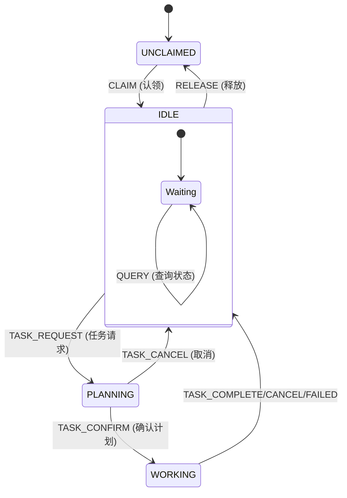

## 📋 项目概述

### 一句话描述
MC_Servant 是一个 Minecraft 服务器智能 NPC 系统，玩家可以通过自然语言与 NPC 交互，让 NPC 帮忙建造房屋、种田、挖矿、守卫家园等。

### 核心卖点（面试展示重点）
1. **自然语言建筑** - 玩家用自然语言描述想要的房子，AI 理解语义并生成建筑方案，分阶段建造
2. **智能交互** - 右键 NPC 开始对话，NPC 头顶实时显示状态
3. **多智能体协作** - 基于 VillagerAgent 的任务分解与执行框架

---

## 🔧 技术决策总结 (修订版)

| 决策项 | 选择 | 原因 |
|--------|------|------|
| **LLM 主力** | **通义千问 Qwen** | 国内访问快，成本低 |
| **通信协议** | **WebSocket** ⚡ | HTTP 延迟 1-2 秒体验差，WebSocket 实时双向通信 |
| **建筑预览** | **WorldEdit API** | 避免粒子掉帧，现成的 Schematic 预览接口 |
| **建筑文件** | **.litematic + litemapy** | Python 库直接解析，省去研究二进制格式 |
| **HTTP 客户端** | **OkHttp** | Java 界事实标准，代码量少一半 |
| **命令框架** | **CommandAPI** | 一行代码定义命令，自动补全和类型检查 |
| **JSON 处理** | **FastJSON2 / Jackson** | 比 Gson 性能更好，复杂嵌套更方便 |
| **头顶显示** | **DecentHolograms** | 成熟稳定，功能丰富 |
| **经济系统** | **Vault + EssentialsX** | 最成熟方案 |
| **Bot 皮肤** | **SkinsRestorer** | 服务端强制换肤，0 开发成本 |

> [!IMPORTANT]
> **版本迁移说明 (2025-12-30)**
> - 服务器已从 **Paper 1.19.2** 升级到 **Paper 1.20.6**
> - Java 版本要求：**JDK 21** (1.20.5+ 强制要求)
> - CommandAPI 从 9.7.0 升级到 **11.1.0** (模块名变更：`commandapi-bukkit-shade` → `commandapi-paper-shade`)
> - Mineflayer 版本配置需匹配：`"version": "1.20.6"`

### 📌 CommandAPI 功能详解 (避免重复造轮子)

> [!TIP]
> CommandAPI 作为**服务器插件**安装后，我们的 MC_Servant 插件直接调用其 API，无需自己实现命令解析逻辑。

**直接使用的核心功能**：
| 功能 | 说明 |  避免重复造轮子 |
|------|------|------------------|
| **参数校验** | 自动验证玩家名、坐标、数字范围等 | 不需自己写正则/类型检查 |
| **自动补全** | Tab 键智能提示可用参数 | 不需手动实现 TabCompleter |
| **权限控制** | 与权限插件无缝集成 | 不需自己处理 OP/权限检查 |
| **`/execute` 兼容** | 支持命令选择器如 `@a`, `@p` | 自动适配原版命令系统 |
| **多语言命令** | 支持命令别名和本地化 | 灵活的命令结构 |

**代码示例** (直接使用 CommandAPI):
```java
// 注册 /servant <action> 命令，使用 CommandAPI 原生功能
new CommandAPICommand("servant")
    .withArguments(new StringArgument("action").replaceSuggestions(
        ArgumentSuggestions.strings("hello", "build", "mine", "farm", "guard")))
    .withOptionalArguments(new PlayerArgument("target"))
    .executes((sender, args) -> {
        String action = (String) args.get("action");
        // 处理逻辑...
    })
    .register();
```

### 🎀 Bot 女仆皮肤方案

> [!NOTE]
> **采用高清皮肤（Skin）方案**，最简单稳定，完美兼容 Mineflayer。

**技术方案**：
| 方案 | 说明 | 优缺点 |
|------|------|--------|
| **SkinsRestorer 换肤** | 服务端强制给 Bot 换肤 | ✅ 0 开发成本，不需资源包 |
| 皮肤类型 | 推荐双层皮肤 (1.8+) | ✅ 外层像素可增加裙子/头发立体感 |

**皮肤获取推荐**：
- [NameMC](https://namemc.com/) - 搜索 "maid" "女仆"
- [MinecraftSkins](https://www.minecraftskins.com/) - 搜索 "anime maid"
- [Planet Minecraft](https://www.planetminecraft.com/skins/) - 高质量社区皮肤

**使用 SkinsRestorer 配置**：
```bash
# 游戏内命令（给 Bot 设置皮肤）
/skin set <BotName> <皮肤玩家名或URL>

# 例如：
/skin set Alice "https://example.com/maid_skin.png"
```

---

## 🏗️ 系统架构 (修订版)

```
┌─────────────────────────────────────────────────────────────────────────────┐
│                           Minecraft Server (Paper 1.20.6)                    │
│  ┌───────────────────┐  ┌──────────────────┐  ┌──────────────────────────┐  │
│  │  MC_Servant       │  │  WorldEdit/FAWE  │  │  DecentHolograms         │  │
│  │  (Java插件)       │  │  (建筑预览)       │  │  (头顶全息显示)           │  │
│  │  - OkHttp         │  └──────────────────┘  └──────────────────────────┘  │
│  │  - CommandAPI     │                                                       │
│  │  - FastJSON2      │  ┌──────────────────────────────────────────────────┐│
│  └────────┬──────────┘  │  Vault + EssentialsX (经济系统)                  ││
│           │ WebSocket   └──────────────────────────────────────────────────┘│
└───────────┼─────────────────────────────────────────────────────────────────┘
            │ 实时双向通信
            ▼
┌─────────────────────────────────────────────────────────────────────────────┐
│                        MC_Servant Backend (Python)                           │
│  ┌─────────────────────────────────────────────────────────────────────┐   │
│  │                    FastAPI + WebSocket Server                        │   │
│  └─────────────────────────────────────────────────────────────────────┘   │
│                                    │                                         │
│  ┌─────────────────────────────────┴─────────────────────────────────────┐ │
│  │                         状态机 (State Machine)                         │ │
│  │     Idle ──→ Planning ──→ Building ──→ Chatting ──→ Idle             │ │
│  └─────────────────────────────────────────────────────────────────────────┘ │
│           ┌────────────────────────┼────────────────────────┐               │
│           ▼                        ▼                        ▼               │
│  ┌─────────────────┐    ┌─────────────────┐    ┌─────────────────────────┐ │
│  │  LLM Service    │    │  VillagerAgent  │    │  Blueprint System       │ │
│  │  (通义千问Qwen)  │    │  (任务执行框架)  │    │  - litemapy解析         │ │
│  │  - 意图识别      │    │  - TaskManager  │    │  - WorldEdit集成        │ │
│  │  - 对话管理      │    │  - BaseAgent    │    │  - 阶段拆分             │ │
│  └─────────────────┘    └────────┬────────┘    └─────────────────────────┘ │
│                                  │                                           │
│                                  ▼                                           │
│                         ┌─────────────────────┐                             │
│                         │   Mineflayer Bots   │                             │
│                         └─────────────────────┘                             │
└─────────────────────────────────────────────────────────────────────────────┘
```

---

## 📁 项目目录结构

```
MC_agent/
├── MC_Server_1.20.6/              # MC服务器 [已升级到1.20.6]
│   ├── start.bat                  # 启动MC服务器 (JDK 21)
│   └── plugins/
│       ├── MC_Servant-1.0.0.jar   # 本项目Java插件
│       ├── WorldEdit/ 或 FAWE/    # [已安装] 建筑预览
│       ├── DecentHolograms/       # [已安装] 全息显示
│       ├── CommandAPI/            # [已安装] 命令框架 (v11.1.0)
│       ├── Vault/                 # [已安装] 经济API
│       └── EssentialsX/           # [已安装] 经济+基础
│
├── VillagerAgent/                 # 原始框架 [已有，作为参考]
│
├── MC_Servant/                    # [新建] 主项目
│   ├── start.bat                 # 启动Python后端
│   ├── README.md                 # 快速启动指南
│   ├── backend/                   # Python后端
│   │   ├── main.py               # FastAPI + WebSocket 入口
│   │   ├── config.py             # 配置管理
│   │   ├── websocket/            # WebSocket 处理
│   │   │   ├── server.py         # WS 服务端
│   │   │   └── handlers.py       # 消息处理器
│   │   ├── llm/                  # LLM服务
│   │   │   ├── qwen_client.py   # 通义千问接入
│   │   │   ├── intent.py        # 意图识别
│   │   │   └── context.py       # 上下文管理
│   │   ├── state/               # 状态机
│   │   │   └── machine.py       # 状态机实现
│   │   ├── builder/             # 建筑系统
│   │   │   ├── architect.py     # 建筑规划(LLM)
│   │   │   ├── litematic.py     # litemapy解析
│   │   │   └── executor.py      # 建造执行
│   │   ├── agent/               # Agent管理
│   │   │   ├── bot_manager.py   # Bot生命周期管理
│   │   │   └── task_executor.py # 任务执行(复用VillagerAgent)
│   │   └── prompts/             # Prompt模板
│   │       ├── intent_system.md     # 意图识别提示
│   │       ├── building_vocab.md    # 建筑风格词汇表
│   │       └── chat_system.md       # 闲聊系统提示
│   │
│   ├── plugin/                   # Java插件源码
│   │   ├── pom.xml              # Maven配置 (含依赖)
│   │   └── src/main/java/
│   │       └── com/mcservant/
│   │           ├── MCServant.java        # 插件主类
│   │           ├── websocket/            # WebSocket客户端
│   │           │   └── WSClient.java     # OkHttp WebSocket
│   │           ├── commands/             # 命令定义 (使用 CommandAPI)
│   │           │   └── ServantCommands.java  # 直接调用 CommandAPI 注册命令
│   │           └── hologram/             # 全息显示封装 (使用 DecentHolograms API)
│   │               └── HologramManager.java
│   │
│   └── docs/                     # 文档
│       └── api.md
│
├── schematics/                    # .litematic 建筑文件库
│   ├── small_house.litematic
│   └── ...
│
└── 00任务规划.md                  # 本文档
```

---

## 🎯 意图识别系统设计

### LLM 意图分类

```python
class Intent(Enum):
    BUILD = "build"      # 建造
    MINE = "mine"        # 挖矿
    FARM = "farm"        # 种田
    GUARD = "guard"      # 守卫
    CHAT = "chat"        # 闲聊
    STATUS = "status"    # 查询状态
    CANCEL = "cancel"    # 取消任务
    UNKNOWN = "unknown"  # 未知
```

### 意图识别 Prompt 示例
```
用户说: "帮我盖个房子"
→ Intent: BUILD, Tags: [house]

用户说: "去挖点铁矿"
→ Intent: MINE, Tags: [iron_ore]

用户说: "你好呀"
→ Intent: CHAT, Tags: []
```

---

## 🔄 状态机设计 (已实现 ✅)



**核心逻辑说明**：
- **UNCLAIMED (无主)**: Bot 自由活动，等待玩家通过 `/servant claim` 认领。
- **IDLE (待命)**: 认领后的默认状态。支持边聊天边待命。
- **PLANNING (规划)**: 收到复杂任务后，LLM 正在思考建造/挖矿方案。
- **WORKING (工作)**: 执行具体任务。
- **Chatting (对话)**: 不作为独立状态，而是作为可在任何状态下发生的“动作”或“事件”。
- **持久化**: `owner_uuid` 等信息保存在 `data/bot_config.json`，重启不丢失所有权。

---

## 📅 开发计划 (修订版) - 8周

### 🔴 第1-2周: 骨架与通信 (最重要!)

> **核心目标**: 打通 Java Plugin ↔ Python FastAPI ↔ Mineflayer Bot 的链路  
> **验收标准**: 玩家输入 `/servant hello`，Bot 跳一下并回复 "Ciallo~~~~"

> [!CAUTION]
> **🚀 启动顺序 (必须遵守)**
> 1. **先启动 MC 服务器** (`MC_Server_1.20.6/start.bat`) - 等待 `Done!`
> 2. **再启动 Python 后端** (`MC_Servant/start.bat`) - Bot 自动连接 MC 并启动 WebSocket 服务
> 3. Java 插件自动重连 WebSocket (支持热重启后端)
>
> **Bot AuthMe 登录**：Bot 账号需提前在 AuthMe 中注册，密码配置在 `backend/config.py`

#### Week 1: 环境搭建 + Java插件骨架

- [x] **安装服务器插件**
  - [x] FAWE ✅（FAWE性能更好）
  - [x] DecentHolograms ✅
  - [x] CommandAPI ✅ (命令框架，用于简化命令注册、参数校验、自动补全)
  - [x] Vault + EssentialsX ✅（经济系统）

- [x] **创建 Java 插件项目**
  - [x] Maven 项目 + pom.xml
  - [x] 添加依赖: OkHttp, CommandAPI, FastJSON2
  - [x] 插件主类 MCServant.java
  - [x] 基础命令 `/servant hello`

- [x] **学习 VillagerAgent**
  - [x] 跑通 example.py
  - [x] 理解 Mineflayer Bot 连接流程

- [x] **配置 Bot 女仆皮肤**
  - [x] 获取高清女仆皮肤文件 (推荐使用双层皮肤增加立体感)
  - [x] 使用 SkinsRestorer 配置 Bot 皮肤
  - [x] 验证 Bot 登录后皮肤正确显示

#### Week 2: WebSocket通信 + 端到端验证

- [x] **Python 后端骨架** ✅ (2025-12-29)
  - [x] FastAPI + WebSocket 服务器 (`backend/main.py`)
  - [x] 基础消息协议定义 (`backend/protocol.py` - pydantic 模型)
  - [x] 配置管理 (`backend/config.py`)
  - [x] WebSocket 连接管理器 (`backend/websocket/connection_manager.py`)
  - [x] 消息处理器 (`backend/websocket/handlers.py`)

- [x] **Java WebSocket 客户端** ✅ (2025-12-29)
  - [x] OkHttp WebSocket 封装 (`websocket/WSClient.java` - 心跳+自动重连)
  - [x] 接口抽象 (`websocket/IWebSocketClient.java`)
  - [x] 消息处理器 (`websocket/MessageHandler.java` - FastJSON2)
  - [x] 更新 MCServant.java 生命周期管理
  - [x] 更新 ServantCommands.java 发送 WebSocket 消息
  - [x] 插件编译成功: `MC_Servant-1.0.0.jar` (5MB)

- [x] **Mineflayer Bot 控制** ✅ (2025-12-29)
  - [x] Bot 控制接口 (`backend/bot/interfaces.py` - IBotController)
  - [x] Mineflayer 实现 (`backend/bot/mineflayer_adapter.py` - 独立实现，不依赖 VillagerAgent)
  - [x] 集成到 WebSocket Server

- [x] **🎯 端到端验证** ✅ (2025-12-30 完成版本迁移验证)
  - [x] 安装 Python 依赖 + Node.js mineflayer
  - [x] 部署插件到服务器
  - [x] `/servant hello` → Python → Bot 跳跃 + 回复 "Ciallo~~~~" ✅
  - [x] 版本迁移 1.19.2 → 1.20.6 验证通过 ✅

---

### 🟡 第3-4周: 接入 LLM 与意图识别

> **核心目标**: 大脑上线，LLM 理解玩家意图  
> **验收标准**: 玩家说"盖个房子" → 识别为 BUILD 意图

#### Week 3: LLM 接入 + 意图识别 + 状态机

- [x] **接入通义千问** ✅ (2025-12-31)
  - [x] API 封装 (`llm/qwen_client.py` - OpenAI 兼容接口)
  - [x] 抽象接口设计 (`llm/interfaces.py` - ILLMClient)
  - [x] 配置管理 (`config.py` 扩展 + `.env.example`)

- [x] **意图识别 Prompt** ✅ (2025-12-31)
  - [x] 设计意图分类体系 (`llm/intent.py` - Intent 枚举)
  - [x] 编写意图识别 System Prompt (INTENT_SYSTEM_PROMPT)
  - [x] 测试各种用户输入 (7/7 测试通过)

#### Week 4: 对话管理 + 分层记忆系统 (核心) ✅ (2026-01-01)

> **核心目标**: 实现基于信息熵压缩的无限层级递归记忆系统 (L0/L1/L2)
> **技术架构**: PostgreSQL + SQLAlchemy (Async) + LruCache + LLM Compression

- [x] **基础设施 (Phase 1-2)**
  - [x] PostgreSQL 数据库环境搭建 (Windows)
  - [x] 异步 ORM 层 (`db/models.py`, `context_repository.py`)
  - [x] 三层记忆模型设计 (L0工作记忆/L1情景记忆/L2核心记忆)

- [x] **记忆流逻辑 (Phase 3)**
  - [x] `ContextManager` (LRU缓存 + 细粒度锁 + 异步压缩队列)
  - [x] L0→L1 叙事化压缩 Prompt (第三人称叙述)
  - [x] L1→L2 认知化压缩 Prompt (用户画像/事实/情感)

- [x] **业务集成 (Phase 4)**
  - [x] Bot 个性化注入 (人格 + L2核心记忆 System Prompt)
  - [x] `IPersonalityProvider` 抽象接口与依赖注入
  - [x] 跨会话持久化 (重启后从 DB 完美复原)
  - [x] 集成到 WebSocket 消息流 (`handlers.py`)

- [x] **系统验证 (Phase 5)**
  - [x] 200+ 轮长对话测试脚本 (`test_long_conversation.py`)
  - [x] 关键事实保留验证 (通过 6/6 核心测试点)
  - [x] 验证 L0→L1→L2 压缩链完整性

- [x] **闲聊功能** ✅ (2025-12-31)
  - [x] 闲聊 Prompt 设计 (`_generate_chat_response`)
  - [x] NPC 人格设定 (猫娘助手，每句话结尾加喵~)

- [x] **头顶全息显示** ✅ (2026-01-01)
  - [x] DecentHolograms API 封装 (`IHologramService`, `HologramManager`)
  - [x] 显示当前状态/正在说的话 (双行: 身份 + 状态)
  - [x] 线程安全 (Bukkit.getScheduler().runTask)
  - [x] 2-tick 跟随频率，Y+2.3 高度偏移

- [x] **交互交互升级** ✅ (2026-01-01)
  - [x] 扩展 `/servant claim|release|list` 命令 (Java Plugin)
  - [x] 实现右键 GUI 管理菜单 (Inventory GUI)
  - [x] **优化 GUI 交互**: 移除重复按钮，使用 Adventure API 实现点击消息预填命令
  - [x] **统一命令格式**: 采用 `/svs @name <消息>` 和 `/servant @name <action>` (支持省略 @name)
  - [x] Python 后端 `servant_command` 消息处理 (ServantCommandHandler)
  - [x] 修复所有权校验逻辑 (兼容 UUID/玩家名双重匹配)
  - [x] 实现 `status` 命令的后端处理
  - [x] DecentHolograms 状态同步

- [x] **Bot 生命周期管理 (Phase 1-3)** ✅ (2026-01-02)
  - [x] **Init Sync 机制**: Java 启动即同步在线玩家并模拟 Join 事件，解决 Python 重启后的状态丢失问题
  - [x] **智能生命周期**: 主人上线 Bot 自动跟随上线，主人下线启动 10 小时倒计时
  - [x] **稳定性增强**: 登录指数退避重试 (5s → 80s)，超时优雅告别并下线
  - [x] **全息显示优化**: 修复无主状态下全息显示丢失问题，支持多行自动换行显示
  - [x] **名牌隐藏**: 自动隐藏 Bot 原版名牌，仅显示全息，优化视觉体验

- [x] **数据库迁移与深度集成 (Phase 4)** ✅ (2026-01-02)
  - [x] **Alembic 迁移**: 引入 Alembic 管理数据库版本，完成 `players` 和 `bots` 表结构升级
  - [x] **AuthMe 深度集成**: Java 监听 `LoginEvent`/`LogoutEvent`，实现仅同步已认证玩家
  - [x] **双向状态同步**: Python ↔ Java 实时同步玩家在线状态 (`is_online`, `last_login`)
  - [x] **上下文持久化修复**: 修复 `ContextManager` 集成 Bug，确保对话记录正确入库
  - [x] **时区统一**: 全局统一使用 Beijing Time (UTC+8) 解决时序错乱问题
  - [x] **Bot 数据同步**: 启动时自动同步 Bot 信息，`claim`/`release` 命令直连数据库

---

### 🟢 第5-6周: 建筑系统 (核心亮点)

> **核心目标**: 自然语言描述 → 生成建筑 → 预览 → 建造  
> **验收标准**: 玩家说"盖个温馨小木屋" → 预览 → 建造成功

> [!IMPORTANT]
> **技术决策：采用动态生成方案**
> - LLM 理解玩家自然语言描述，输出结构化建筑数据（方块类型、相对坐标）
> - Python 代码解析 LLM 输出，生成方块放置指令序列
> - Mineflayer Bot 逐步执行放置方块
> - 优势：灵活性高，可根据描述生成任意建筑
> - 劣势：实现复杂，需要设计建筑规划 Prompt + 输出格式校验

#### Week 5: 建筑规划 + 蓝图系统

- [ ] **建筑规划 Prompt**
  - [ ] 整理建筑风格词汇表
  - [ ] 设计建筑规划 System Prompt
  - [ ] LLM 输出结构化建筑方案

- [ ] **蓝图数据结构**
  - [ ] 文本描述 → 结构化 JSON
  - [ ] 对接 .litematic 模板库

- [ ] **litemapy 集成**
  - [ ] 解析 .litematic 文件
  - [ ] 提取方块坐标数据

#### Week 6: 预览 + 分阶段建造

- [ ] **WorldEdit 预览**
  - [ ] Java 调用 WorldEdit API
  - [ ] 显示建筑轮廓/地基

- [ ] **用户确认流程**
  - [ ] 展示方案 → 等待确认/修改

- [ ] **分阶段建造**
  - [ ] 蓝图 → VillagerAgent 任务序列
  - [ ] 进度反馈 (头顶 + 聊天)

---

### 🔵 第7周: 其他功能 + NPC系统

- [ ] **快速接入其他功能**
- [ ] **NPC 购买与所有权系统**
  - [ ] 与 Vault 经济集成
  - [x] 所有权管理与持久化 (BotConfig)
  - [x] `/servant claim/release/list` 命令实现
  - [x] 右键交互菜单 GUI 实现 (ServantMenuGUI)
  - [ ] `/servant buy/call` 命令实现 (后续)

---

### ⚪ 第8周: 测试与演示

- [ ] **功能测试**
  - [ ] 各意图场景测试
  - [ ] 建筑系统完整流程测试
  - [ ] 多玩家场景测试

- [ ] **演示准备**
  - [ ] 录制演示视频
  - [ ] 准备面试讲稿
  - [ ] 整理项目文档

- [ ] **优化**
  - [ ] 性能优化
  - [ ] 用户体验优化
  - [ ] Bug 修复

---

## 📝 消息协议设计 (WebSocket)

### Java → Python
```json
{
  "type": "player_message",
  "player": "PlayerName",
  "npc": "Alice",
  "content": "帮我盖个房子",
  "timestamp": 1703587200
}
```

### Python → Java (NPC 响应)
```json
{
  "type": "npc_response",
  "npc": "Alice",
  "target_player": "PlayerName",
  "content": "好的主人，您想要什么风格的房子？",
  "hologram_text": "💭 思考中...",
  "action": "chat"
}
```

### Java → Python (系统命令)
```json
{
  "type": "servant_command",
  "player": "HCID273",
  "player_uuid": "xxx",
  "command": "claim",
  "target_bot": "Alice",
  "timestamp": 1703587200
}
```

### Python → Java (Bot 直接动作)
```json
{
  "type": "bot_command",
  "npc": "Alice",
  "command": "jump",
  "args": {}
}
```

---

## 🔑 关键风险与应对 (修订版)

| 风险 | 可能性 | 影响 | 应对方案 |
|------|--------|------|---------|
| WebSocket 连接不稳定 | 中 | 高 | 心跳检测 + 自动重连 |
| LLM 意图识别不准 | 高 | 中 | Few-shot 示例 + 用户确认 |
| 建筑结构不合理 | 高 | 中 | 使用预制 .litematic 模板 |
| Mineflayer Bot 卡顿 | 中 | 高 | 错误重试 + 人工干预 |
| 多玩家并发 | 中 | 中 | Bot 资源池 + 任务队列 |

---

## 📚 技术栈参考链接

### Java 插件开发
- [Paper API](https://docs.papermc.io/)
- [CommandAPI](https://commandapi.jorel.dev/)
- [OkHttp](https://square.github.io/okhttp/)
- [FastJSON2](https://github.com/alibaba/fastjson2)
- [WorldEdit API](https://worldedit.enginehub.org/en/latest/api/)
- [DecentHolograms API](https://github.com/DecentSoftware-eu/DecentHolograms)

### Python
- [FastAPI WebSocket](https://fastapi.tiangolo.com/advanced/websockets/)
- [litemapy](https://github.com/SmylerMC/litemapy)
- [通义千问 API](https://help.aliyun.com/document_detail/2400395.html)

### VillagerAgent
- [GitHub](https://github.com/cnsdqd-dyb/VillagerAgent)
- [论文](https://arxiv.org/abs/2406.05720)

---

## ✅ 下一步行动 (Week 1)

1. [ ] 安装服务器插件 (WorldEdit, DecentHolograms, Vault, EssentialsX)
2. [ ] 创建 Java 插件 Maven 项目
3. [ ] 跑通 VillagerAgent example.py
4. [ ] 实现 `/servant hello` 基础命令

---

*文档创建时间: 2025-12-26*  
*最后更新: 2026-01-02 (v6 - Bot 生命周期管理 Phase 2 & 3 完整实现)*