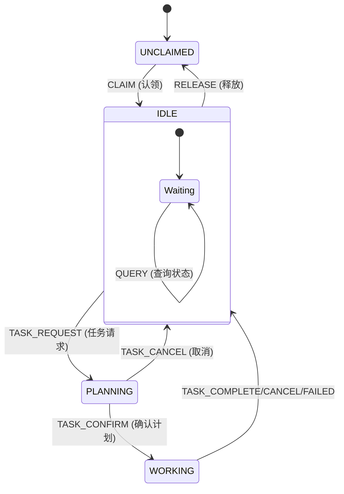

# MC_Servant 项目背景与架构

> **项目定位**: Minecraft 服务器智能 NPC 系统  
> **最后更新**: 2026-01-03

---

## 📋 项目概述

### 一句话描述
MC_Servant 是一个 Minecraft 服务器智能 NPC 系统，玩家可以通过自然语言与 NPC 交互，让 NPC 帮忙建造房屋、种田、挖矿、守卫家园等。

### 核心卖点（面试展示重点）
1. **采集闭环（感知-决策-执行）** - 采集类任务启用 Tick Loop（每次只决策一步），不会因为环境变化而“计划过期”
2. **神经-符号架构（Neuro-Symbolic）** - LLM 只负责语义/意图，符号层负责落地（候选集/扫描/参照系锚定/规则库），显著降低幻觉与卡死
3. **智能交互** - 右键 NPC 开始对话，NPC 头顶实时显示状态
4. **自然语言建筑（后续扩展方向）** - 建筑属于确定性任务，可在采集闭环稳定后引入蓝图/模板/分阶段建造

---

## 🔧 技术决策总结

| 决策项 | 选择 | 原因 |
|--------|------|------|
| **LLM 主力** | **通义千问 Qwen** | 国内访问快，成本低 |
| **通信协议** | **WebSocket** ⚡ | HTTP 延迟 1-2 秒体验差，WebSocket 实时双向通信 |
| **建筑预览** | **WorldEdit API** | 避免粒子掉帧，现成的 Schematic 预览接口 |
| **建筑文件** | **.litematic + litemapy** | Python 库直接解析，省去研究二进制格式 |
| **HTTP 客户端** | **OkHttp** | Java 界事实标准，代码量少一半 |
| **命令框架** | **CommandAPI** | 一行代码定义命令，自动补全和类型检查 |
| **JSON 处理** | **FastJSON2 / Jackson** | 比 Gson 性能更好，复杂嵌套更方便 |
| **头顶显示** | **DecentHolograms** | 成熟稳定，功能丰富 |
| **经济系统** | **Vault + EssentialsX** | 最成熟方案 |
| **Bot 皮肤** | **SkinsRestorer** | 服务端强制换肤，0 开发成本 |

> [!IMPORTANT]
> **版本迁移说明 (2025-12-30)**
> - 服务器已从 **Paper 1.19.2** 升级到 **Paper 1.20.6**
> - Java 版本要求：**JDK 21** (1.20.5+ 强制要求)
> - CommandAPI 从 9.7.0 升级到 **11.1.0** (模块名变更：`commandapi-bukkit-shade` → `commandapi-paper-shade`)
> - Mineflayer 版本配置需匹配：`"version": "1.20.6"`

---

## 🏗️ 系统架构

```
┌─────────────────────────────────────────────────────────────────────────────┐
│                           Minecraft Server (Paper 1.20.6)                    │
│  ┌───────────────────┐  ┌──────────────────┐  ┌──────────────────────────┐  │
│  │  MC_Servant       │  │  WorldEdit/FAWE  │  │  DecentHolograms         │  │
│  │  (Java插件)       │  │  (建筑预览)       │  │  (头顶全息显示)           │  │
│  │  - OkHttp         │  └──────────────────┘  └──────────────────────────┘  │
│  │  - CommandAPI     │                                                       │
│  │  - FastJSON2      │  ┌──────────────────────────────────────────────────┐│
│  └────────┬──────────┘  │  Vault + EssentialsX (经济系统)                  ││
│           │ WebSocket   └──────────────────────────────────────────────────┘│
└───────────┼─────────────────────────────────────────────────────────────────┘
            │ 实时双向通信
            ▼
┌─────────────────────────────────────────────────────────────────────────────┐
│                        MC_Servant Backend (Python)                           │
│  ┌─────────────────────────────────────────────────────────────────────┐   │
│  │                    FastAPI + WebSocket Server                        │   │
│  └─────────────────────────────────────────────────────────────────────┘   │
│                                    │                                         │
│  ┌─────────────────────────────────┴─────────────────────────────────────┐ │
│  │                         状态机 (State Machine)                         │ │
│  │     UNCLAIMED ─→ IDLE ─→ PLANNING ─→ WORKING ─→ IDLE                   │ │
│  └─────────────────────────────────────────────────────────────────────────┘ │
│           ┌──────────────────────────────┼──────────────────────────────┐   │
│           ▼                              ▼                              ▼   │
│  ┌─────────────────┐          ┌─────────────────────┐          ┌─────────────────┐ │
│  │  LLM Service    │          │  Task Executor       │          │  Perception      │ │
│  │  (Qwen)         │          │  - 线性 Plan/Replan  │          │  - KnowledgeBase │ │
│  │  - 意图识别      │          │  - Tick Loop（采集） │          │  - Scanner       │ │
│  │  - Planner/Actor │          │  - Inventory Delta   │          │  - EntityResolver│ │
│  └─────────────────┘          └──────────┬──────────┘          └─────────────────┘ │
│                                          │                                         │
│                                          ▼                                         │
│                                 ┌─────────────────────┐                           │
│                                 │  Bot Actions        │                           │
│                                 │  (Mineflayer)       │                           │
│                                 │  + Rulebook         │                           │
│                                 └─────────────────────┘                           │
└─────────────────────────────────────────────────────────────────────────────┘
```

---

## 📁 项目目录结构

```
MC_agent/
├── MC_Server_1.20.6/              # MC服务器 [已升级到1.20.6]
│   ├── start.bat                  # 启动MC服务器 (JDK 21)
│   └── plugins/
│       ├── MC_Servant-1.0.0.jar   # 本项目Java插件
│       ├── WorldEdit/ 或 FAWE/    # [已安装] 建筑预览
│       ├── DecentHolograms/       # [已安装] 全息显示
│       ├── CommandAPI/            # [已安装] 命令框架 (v11.1.0)
│       ├── Vault/                 # [已安装] 经济API
│       └── EssentialsX/           # [已安装] 经济+基础
│
├── VillagerAgent/                 # 原始框架 [作为参考]
│
├── MC_Servant/                    # 主项目
│   ├── start.bat                 # 启动Python后端
│   ├── backend/                   # Python后端
│   │   ├── main.py               # FastAPI + WebSocket 入口
│   │   ├── config.py             # 配置管理
│   │   ├── websocket/            # WebSocket 处理
│   │   ├── llm/                  # LLM服务
│   │   ├── state/               # 状态机
│   │   ├── bot/                 # Bot 控制 (Mineflayer)
│   │   ├── perception/          # 感知 + 神经符号解析 (KB/Scanner/Resolver/Inventory)
│   │   ├── task/                # 任务执行框架
│   │   └── db/                  # 数据库 (PostgreSQL)
│   │
│   ├── plugin/                   # Java插件源码
│   │   ├── pom.xml              # Maven配置
│   │   └── src/main/java/com/mcservant/
│   │
│   └── 00Docs/                   # 文档
│       └── MC_Servant/
│           ├── 00项目背景与架构.md    # 本文档
│           ├── 01开发进度追踪.md      # 进度 Checklist
│           └── 02技术调研与设计.md    # 技术方案
│
└── schematics/                    # .litematic 建筑文件库
```

---

## 🔄 状态机设计



**核心逻辑说明**：
- **UNCLAIMED (无主)**: Bot 自由活动，等待玩家通过 `/servant claim` 认领。
- **IDLE (待命)**: 认领后的默认状态。支持边聊天边待命。
- **PLANNING (规划)**: 收到复杂任务后，LLM 正在思考建造/挖矿方案。
- **WORKING (工作)**: 执行具体任务。
- **持久化**: `owner_uuid` 等信息保存在数据库，重启不丢失所有权。

---

## 📝 消息协议设计 (WebSocket)

### Java → Python (玩家消息)
```json
{
  "type": "player_message",
  "player": "PlayerName",
  "npc": "Alice",
  "content": "帮我盖个房子",
  "player_x": 100.1,
  "player_y": 64.0,
  "player_z": 200.7,
  "timestamp": 1703587200
}
```

### Python → Java (NPC 响应)
```json
{
  "type": "npc_response",
  "npc": "Alice",
  "target_player": "PlayerName",
  "content": "好的主人，您想要什么风格的房子？",
  "segments": ["好的主人，", "您想要什么风格的房子？"],
  "hologram_text": "💭 思考中...",
  "action": "chat"
}
```

### Java → Python (系统命令)
```json
{
  "type": "servant_command",
  "player": "HCID273",
  "player_uuid": "xxx",
  "command": "claim",
  "target_bot": "Alice",
  "timestamp": 1703587200
}
```

> [!NOTE]
> 后端的 Mineflayer Bot 动作（goto/mine/mine_tree 等）由 Python 侧直接驱动，不通过 Java 插件转发 “bot_command”。

---

## 🔑 关键风险与应对

| 风险 | 可能性 | 影响 | 应对方案 |
|------|--------|------|----------|
| WebSocket 连接不稳定 | 中 | 高 | 心跳检测 + 自动重连 |
| LLM 意图识别不准 | 高 | 中 | Few-shot 示例 + 用户确认 |
| 建筑结构不合理 | 高 | 中 | 使用预制 .litematic 模板 |
| Mineflayer Bot 卡顿 | 中 | 高 | 错误重试 + 人工干预 |
| 多玩家并发 | 中 | 中 | Bot 资源池 + 任务队列 |

---

## 📚 技术栈参考链接

### Java 插件开发
- [Paper API](https://docs.papermc.io/)
- [CommandAPI](https://commandapi.jorel.dev/)
- [OkHttp](https://square.github.io/okhttp/)
- [FastJSON2](https://github.com/alibaba/fastjson2)
- [WorldEdit API](https://worldedit.enginehub.org/en/latest/api/)
- [DecentHolograms API](https://github.com/DecentSoftware-eu/DecentHolograms)

### Python
- [FastAPI WebSocket](https://fastapi.tiangolo.com/advanced/websockets/)
- [litemapy](https://github.com/SmylerMC/litemapy)
- [通义千问 API](https://help.aliyun.com/document_detail/2400395.html)

### VillagerAgent
- [GitHub](https://github.com/cnsdqd-dyb/VillagerAgent)
- [论文](https://arxiv.org/abs/2406.05720)

---

## 🚀 启动顺序 (必须遵守)

> [!CAUTION]
> 1. **先启动 MC 服务器** (`MC_Server_1.20.6/start.bat`) - 等待 `Done!`
> 2. **再启动 Python 后端** (`MC_Servant/start.bat`) - Bot 自动连接 MC 并启动 WebSocket 服务
> 3. Java 插件自动重连 WebSocket (支持热重启后端)
>
> **Bot AuthMe 登录**：Bot 账号需提前在 AuthMe 中注册，密码配置在 `backend/config.py`

---

*文档创建时间: 2025-12-26*  
*最后更新: 2026-01-03*
