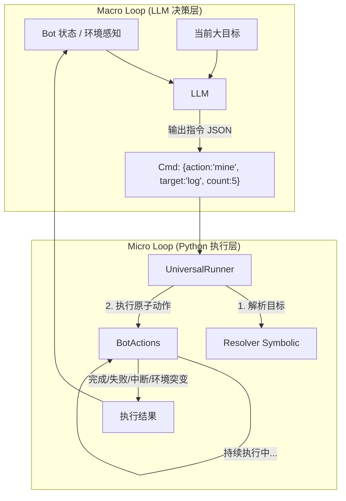
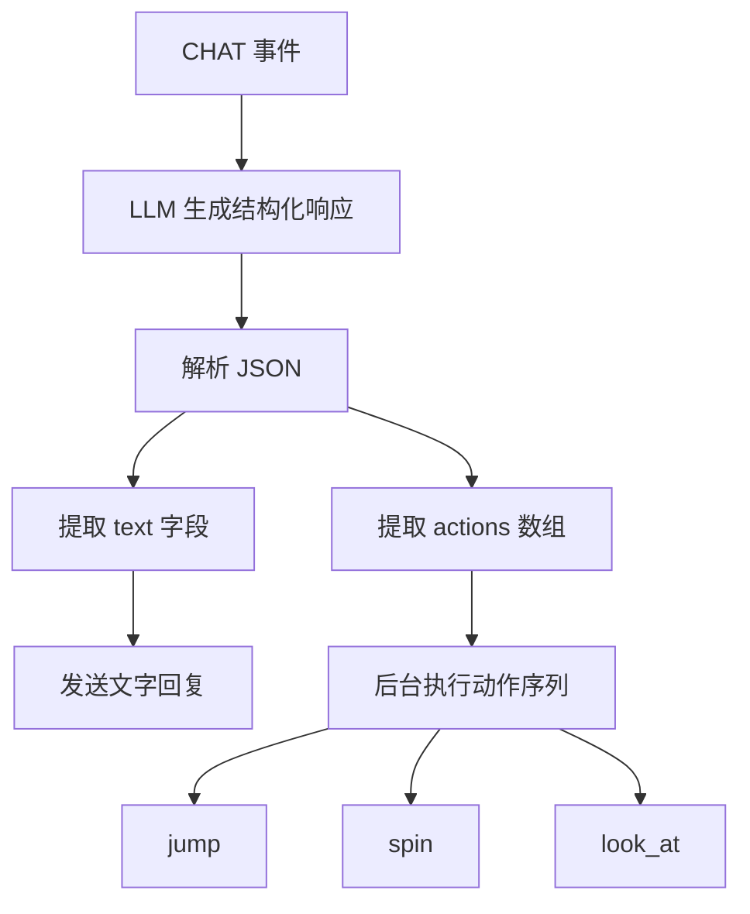

# MC_Servant 技术调研与设计

> **调研日期**: 2026-01-04 (目标架构蓝图)
> **设计原则**: 简单的接口，深度的功能；依赖抽象，而非具体
> **架构状态**: 目标架构蓝图（后续代码以此为准）

---

## 📊 VillagerAgent 架构对比

| 维度 | VillagerAgent | MC_Servant (目标态) |
|------|--------------|-------------------|
| **Bot 动作数** | 47+ 高级 API | ✅ 多个原子动作 + 专用动作 (goto/mine/scan/craft/place/give/equip/mine_tree 等) |
| **任务系统** | DAG 任务图 + 依赖管理 | ✅ **UniversalRunner** + **通用 Tick Loop** (Micro-Loop) + **Stack Planner** |
| **LLM 集成** | Langchain Agent + Function Calling | ✅ 结构化 JSON 指令序列 + **动态微观闭环** (Micro-Loop) + **LLM 驱动恢复/澄清** |
| **智能水平** | 自主选择工具，通用性强 | ✅ **双脑架构**：LLM 负责模糊意图与异常决策，Python 负责精确感知与动作执行 |
| **多智能体** | 支持 N 个 Agent 协作 | 单 Bot (架构原生支持多 Bot) |
| **强化学习** | PPO Actor-Critic (动作选择优化) | (暂无，聚焦 Neuro-Symbolic) |
| **通信方式** | HTTP (JS Server ↔ Python) | WebSocket (Java 插件 ↔ Python) + JS 模块直连 Mineflayer |
| **环境抽象** | VillagerBench (标准化评测) | 无 Benchmark |

---

## 🏗️ 目标架构：Universal Tick Loop

目标是打破之前为每个任务（如 Gather, Combat）编写独立 "Runner" 的模式，转而采用一个通用的 **UniversalRunner**。

### 核心理念

*   **Python (身体)**：负责 **感知 (Observe)** 和 **执行 (Act)**。处理精确的坐标、微观的动作循环、协议通信。
*   **LLM (大脑)**：负责 **决策 (Think)**。处理模糊的意图、异常情况的应对、策略的切换。

### 架构图解



### 关键机制：微观闭环 (Micro-Loops)

为了解决 LLM API 延迟问题（不能每 50ms 问一次），我们引入 "指令持续性"。

- LLM 的指令不是瞬间的，而是一个 "短期目标 (Sub-Goal)"。
    - 例如：`{"action": "mine", "target": "iron_ore", "limit": 5}`
- Python 接管微观操作：
    - 只要目标存在且未完成，Python 代码就会在 Tick Loop 中持续驱动 Bot（寻路 -> 挖掘 -> 寻路 -> 挖掘）。
    - 中断机制 (Interrupts)：在 Micro-Loop 期间，如果发生 高优先级事件（如血量骤降、收到 Owner 的新 Chat 指令），Python 侧虽然在跑 Loop，但会立即感知并中断，上报给 LLM。
    - 不打扰 LLM：除非挖够了、彻底因故卡死、或环境发生剧变，否则不请求新的指令。
    - 失败即反馈：Micro-Loop 失败会携带完整上下文回传给 LLM，由 LLM 决定恢复动作或澄清问题。

## 🔧 Phase 1: 底层 - Mineflayer 插件集成 (保持不变)

参见原 Phase 1 文档，Mineflayer 插件集成与加载逻辑保持不变。

## 🦾 Phase 2: 中层 - 原子动作封装 (Toolbox)

现在，BotActions 不再是业务逻辑的承载者，而是 UniversalRunner 的工具箱。

### 核心接口

保持 IBotActions 接口定义，但明确其定位为 原子动作 (Atomic Actions)。

- `goto(target)`: 只负责走路，不负责问 "为什么去"。
- `mine(block_type, count)`: 只负责挖，不负责问 "挖不到怎么办"。

### Resolver (符号层落地)

Resolver 是 Neuro-Symbolic 架构的核心护城河，负责将 LLM 的 语义意图 转化为 物理坐标。

- 语义输入: `target: "log"` (LLM 说要这个)
- 符号输出: `coordinates: (100, 64, 200)` (Resolver 扫描环境得出的)

原有 EntityResolver 设计保留，作为 UniversalRunner 的核心依赖。

## 🧠 Phase 3: 顶层 - 通用智能体架构

### 1. UniversalRunner (通用执行器)

目标取代 GatherRunner, LinearPlanRunner 等专用 Runner。

职责：

1. 接收 LLM 指令: 解析 JSON 格式的 Sub-Goal。
2. 维持 Micro-Loop: 只要 Sub-Goal 没完成且没失败，就持续调用 BotActions。
3. 感知与中断: 每 tick 检查自身状态（血量、饥饿）和外部信号（Chat 指令）。
4. 异常上报: 当 Micro-Loop 彻底失败（如 PATH_NOT_FOUND 重试无效），将错误上下文打包发回 LLM。

### 2. 行为规则 (Behavior Rules) 的降级

之前 behavior_rules.json 里的规则（如 "找不到路就随机走"）不再强制硬编码在 Python 里，它们被转化为 System Prompt 的一部分，作为 "赛博经验" 喂给 LLM。

- 以前 (Code): `if error == PATH_NOT_FOUND: random_move()`
- 现在 (Prompt): `System: If you find yourself stuck or unable to reach a target, consider giving a 'random_move' command to unstuck, or try 'dig_up'.`

LLM 自主决定是否采纳这些建议，Python 不再内置硬恢复路径。

### 3. LLM 驱动恢复 (LLM Recovery)

Micro-Loop 失败时，Runner 会将 错误码、环境状态、上一步动作 一并传回 LLM，由 LLM 决定是 重试、换目标、尝试解卡动作，或发起 澄清问题。

- 输入：`last_result + bot_state + goal + hints`
- 输出：
    - 正常: `{"action": "mine", "target": "oak_log"}`
    - 恢复: `{"action": "random_move", "reason": "stuck"}`
    - 澄清: `{"action": "chat", "content": "附近没有木头了，还继续吗？"}`

### 4. LLM 决策流 (Decision Flow)

1. Analyze: 收到状态更新/失败上下文，分析当前处境。
2. Recall: 检索记忆（Hints, Context）。
3. Plan: 生成下一个 Sub-Goal 或澄清问题。
    - 正常: `{"action": "mine", "target": "oak_log"}`
    - 异常: `{"action": "random_move", "reason": "stuck_logic"}`
    - 澄清: `{"action": "chat", "content": "主人，附近没有木头了，还要挖吗？"}`

## 🧬 Phase 4: 神经-符号语义解析系统 (保持核心)

参见原 Phase 4 文档，EntityResolver 和 KnowledgeBase 构建逻辑保持不变，它们是 UniversalRunner "解析目标" 步骤的关键支撑。

## 🌐 Phase 5: 神经编译器架构 (Neural Compiler) (可选/远期)

保持原文档关于端云协同的愿景，作为后续优化的方向。

---

## 📁 目录结构规划 (更新)

```
MC_Servant/backend/
├── bot/
│   ├── interfaces.py          # IBotController, IBotActions
│   ├── mineflayer_adapter.py  # MineflayerBot
│   ├── actions.py             # MineflayerActions (Atomic Tools)
│   ├── tag_resolver.py        # Tag-aware craft
│   └── lifecycle_manager.py   # Bot Lifecycle
│
├── task/
│   ├── executor.py            # TaskExecutor (入口)
│   ├── universal_runner.py    # [NEW] UniversalRunner (取代旧 Runner)
│   ├── llm_planner.py         # UniversalPlanner (LLM Interface)
│   ├── stack_planner.py       # Stack 管理
│   └── runners/               # [DEPRECATED] 旧 Runner 归档
│
├── perception/
│   └── resolver.py            # EntityResolver (Symbolic Grounding)
│
├── llm/
│   └── ...
│
├── data/
│   ├── mc_knowledge_base.json # 语义知识库
│   └── behavior_hints.txt     # [NEW] 规则转化的 Prompt 提示词
│
└── state/
    └── ...
```

---

## 🎭 Phase 6: 表演动作系统 (Performance Actions)

### 背景问题
当用户说"给我跳个舞"时，Bot 只会用文字回复"好的主人，我在跳舞喵~"，而不会真正"动起来"。

### 解决方案：Chat + Performance 架构

在 CHAT 事件处理中，让 LLM 不仅生成文字回复，还能同时返回动作指令。

#### 1. 新增表演动作接口 (IBotController)

```python
async def spin(self, rotations: int = 1, duration: float = 1.0) -> bool:
    """原地旋转（表演动作）"""
    
async def look_at(self, target: str) -> bool:
    """看向目标（表演动作）"""
```

#### 2. 增强版 Chat LLM Prompt

```
## 可用动作
- spin: 原地转圈 (rotations=圈数)
- jump: 跳跃
- look_at: 看向主人 (target="@玩家名")

## 响应格式 (JSON)
{
    "text": "说的话",
    "actions": [{"type": "spin", "rotations": 2}, {"type": "jump"}]
}
```

#### 3. IdleState CHAT 处理流程



#### 4. 关键代码位置

- `bot/interfaces.py`: IBotController.spin(), IBotController.look_at()
- `bot/mineflayer_adapter.py`: MineflayerBot._do_spin(), MineflayerBot._do_look_at()
- `state/states.py`: IdleState._generate_chat_response(), IdleState._execute_performance_actions()
- `state/context.py`: BotContext.bot (IBotController 注入)

---

更新时间: 2026-01-04 (表演动作功能)