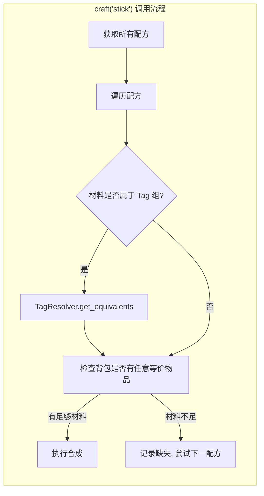
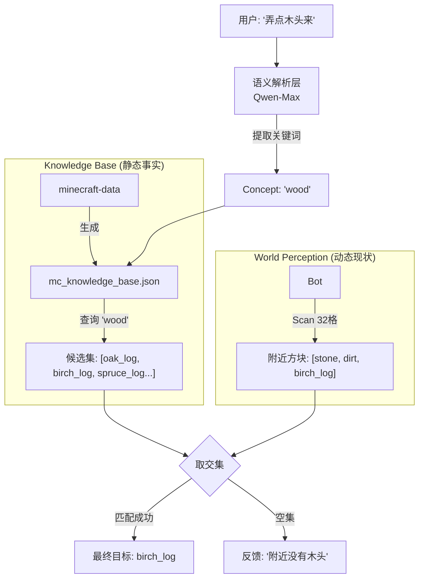

# MC_Servant 技术调研与设计

> **调研日期**: 2026-01-03 (更新)  
> **设计原则**: 简单的接口，深度的功能；依赖抽象，而非具体

---

## 📊 VillagerAgent 架构对比

| 维度 | VillagerAgent | MC_Servant (当前) |
|------|--------------|-------------------|
| **Bot 动作数** | 47+ 高级 API | ✅ 多个原子动作 + 专用动作 (goto/mine/scan/craft/place/give/equip/mine_tree 等) |
| **任务系统** | DAG 任务图 + 依赖管理 | ✅ 状态机 + 栈式任务系统 (StackPlanner) + Tick Loop 执行 |
| **LLM 集成** | Langchain Agent + Function Calling | ✅ 结构化 JSON 输出 + plan/replan + Tick Loop act()（每次只决策一步） |
| **多智能体** | 支持 N 个 Agent 协作 | 单 Bot |
| **强化学习** | PPO Actor-Critic (动作选择优化) | 无 |
| **通信方式** | HTTP (JS Server ↔ Python) | javascript 模块直接调用 |
| **环境抽象** | VillagerBench (标准化评测) | 无 Benchmark |

---

## 🏗️ VillagerAgent 核心技术栈

### 1. 任务分解系统 (TaskManager)

```
用户输入: "Build a wooden house with 2 rooms"
           ↓ LLM 分解
┌──────────────────────────────────────────────────────┐
│  Subtask DAG (有向无环图)                              │
│                                                       │
│  [收集木头] ──→ [合成木板] ──→ [建造地基]               │
│                    ↓              ↓                  │
│              [合成门] ──→ [建造墙壁] ──→ [安装门窗]     │
│                              ↓                       │
│                        [建造屋顶]                     │
└──────────────────────────────────────────────────────┘
```

**关键代码**: `TaskManager.init_task()`
- 使用 LLM 将自然语言分解为结构化子任务
- 自动构建依赖关系图 (NetworkX)
- 支持动态任务更新 (update) 和合并 (merge) 两种模式

### 2. Agent 执行引擎 (BaseAgent)

```python
# 三种执行模式
class BaseAgent:
    def step(self, task):
        if self.RL_mode:
            return self.rl_step(task)       # RL 推荐动作 + LLM 执行
        elif self.local_mode:
            return self.local_step(task)    # 本地小模型执行
        else:
            return self.normal_step(task)   # 纯 LLM 决策
```

**normal_step 流程**:
1. 构建包含任务描述/环境状态/历史动作的 Prompt
2. 调用 LLM (GPT-4/Gemini) 生成动作序列
3. 通过 Langchain Agent 执行 Mineflayer API
4. 收集执行结果，调用 `reflect()` 评估任务状态

### 3. 强化学习模块 (PPO)

```
┌─────────────────────────────────────────────────────────┐
│  PPO Actor-Critic 架构                                   │
├─────────────────────────────────────────────────────────┤
│                                                          │
│  输入: "instruction + state + history" (文本)            │
│           ↓                                              │
│  [Qwen2.5-0.5B] → 提取 hidden_states (冻结)              │
│           ↓                                              │
│  [MLP Head] → 47 维动作概率分布                          │
│           ↓                                              │
│  sample() → 推荐动作 (如 "navigateTo")                   │
│           ↓                                              │
│  [GPT-4/Gemini] → 生成具体参数并执行                     │
│           ↓                                              │
│  [LLM Reflect] → 评估结果 → 计算 Reward                  │
│           ↓                                              │
│  [Replay Buffer] → PPO train_step() 更新网络             │
│                                                          │
└─────────────────────────────────────────────────────────┘
```

**关键洞察**:
- RL 模型**不直接控制 Bot**，只负责**推荐下一个 API 动作**
- 奖励信号来自 **LLM 的反思评估**，不是游戏内奖励
- 使用小模型 (0.5B) 做特征提取，训练成本低
- 在线学习：每执行 1 步就更新模型

---

## 🎯 MC_Servant 分层控制架构 (Layered Control Architecture)

```
┌─────────────────────────────────────────────────────────────┐
│  Layer 3: LLM Planner (大脑)                                 │
│  ├── 输入: 自然语言任务 "帮我挖点铁矿"                        │
│  ├── 输出: JSON 动作序列 [{"action": "mine", "target": ...}] │
│  └── 依赖: ITaskPlanner 抽象接口                             │
└─────────────────────────────┬───────────────────────────────┘
                              ↓ ActionPlan (高层指令)
┌─────────────────────────────────────────────────────────────┐
│  Layer 2: Python Actions (四肢技能)                          │
│  ├── 参数解析 + 语义目标转坐标                               │
│  ├── 错误处理 + 超时控制 + 重试逻辑                          │
│  ├── 返回 ActionResult 给上层反思                            │
│  └── 依赖: IBotActions 抽象接口                              │
└─────────────────────────────┬───────────────────────────────┘
                              ↓ javascript 模块调用
┌─────────────────────────────────────────────────────────────┐
│  Layer 1: Mineflayer Plugins (神经末梢)                      │
│  ├── pathfinder - 寻路导航 + 避障                            │
│  ├── collectblock - 自动采集方块                             │
│  ├── tool - 自动选择正确工具                                 │
│  └── 依赖: Mineflayer Bot 实例                               │
└─────────────────────────────────────────────────────────────┘
```

---

## 🔧 Phase 1: 底层 - Mineflayer 插件集成

### 必须安装的 npm 包

```bash
cd MC_Servant/backend
npm install mineflayer-pathfinder mineflayer-collectblock mineflayer-tool
```

| 插件 | 功能 | 关键能力 |
|------|------|----------|
| `mineflayer-pathfinder` | 寻路导航 | A* 算法、避障、跳跃/游泳 |
| `mineflayer-collectblock` | 方块采集 | 自动寻找 + 路径 + 挖掘 |
| `mineflayer-tool` | 工具选择 | 自动选择最佳工具 |

### 插件加载代码

```javascript
// 在 Bot 初始化时加载插件
const pathfinder = require('mineflayer-pathfinder').pathfinder;
const collectBlock = require('mineflayer-collectblock').plugin;
const toolPlugin = require('mineflayer-tool').plugin;

bot.loadPlugin(pathfinder);
bot.loadPlugin(collectBlock);
bot.loadPlugin(toolPlugin);
```

> [!IMPORTANT]
> **NPM 依赖路径**  
> 务必确保 `npm install` 是在 `MC_Servant/backend/` 目录下执行的，因为 Python 的 `javascript` 库会在**当前运行目录**查找 `node_modules`。

> [!WARNING]
> **Javascript Promise 与 Python Await**  
> `javascript` 库 (JSPyBridge) 处理 JS Promise 有时比较玄学。如果 `await self.bot.collectBlock.collect(target)` 卡住，可能需要用 `asyncio.to_thread` 包装，或者检查 JS 端是否真的返回了 Promise。不过 `mineflayer-collectblock` 通常表现良好。

> [!TIP]
> **Bot 状态的 Token 优化**  
> 在 `get_state()` 中，`inventory` 如果包含大量物品，会占用很多 Token。  
> **优化建议**：将 inventory 简化为合并同类项格式：
> ```json
> {"iron_ore": 64, "cobblestone": 128, "oak_log": 32}
> ```
> 而不是列出每个格子的详细数据。

---

## 🦾 Phase 2: 中层 - 原子动作封装

### 核心接口定义 (依赖抽象)

```python
# backend/bot/interfaces.py

from abc import ABC, abstractmethod
from dataclasses import dataclass
from typing import Optional, Any, List
from enum import Enum


class ActionStatus(Enum):
    """动作执行状态"""
    SUCCESS = "success"
    FAILED = "failed"
    TIMEOUT = "timeout"
    CANCELLED = "cancelled"


@dataclass
class ActionResult:
    """
    动作执行结果 - 统一的反馈结构
    
    所有动作都必须返回此结构，供 LLM 反思决策
    """
    success: bool
    action: str                    # 执行的动作名
    message: str                   # 人类可读的描述
    status: ActionStatus           # 状态枚举
    data: Optional[Any] = None     # 返回数据（如采集的物品列表）
    error_code: Optional[str] = None  # 错误码
    duration_ms: int = 0           # 执行耗时
    
    # 常见错误码定义
    # INVENTORY_FULL - 背包满了
    # TOOL_BROKEN - 工具损坏
    # TARGET_NOT_FOUND - 找不到目标
    # PATH_BLOCKED - 路径被阻挡
    # TIMEOUT - 超时
    # NO_TOOL - 没有合适工具


class IBotActions(ABC):
    """
    Bot 动作抽象接口
    
    设计原则：
    - 简单的接口：方法参数使用语义化名称，不暴露坐标细节
    - 深度的功能：内部封装寻路、工具选择、错误处理
    - 依赖抽象：上层只依赖此接口，不依赖 Mineflayer 具体实现
    """
    
    @abstractmethod
    async def goto(self, target: str) -> ActionResult:
        """导航到目标位置 (支持: 坐标字符串, @玩家名, 语义位置)"""
        pass
    
    @abstractmethod
    async def mine(self, block_type: str, count: int = 1) -> ActionResult:
        """采集指定类型的方块 (自动处理: 寻找、导航、选工具、挖掘)"""
        pass
    
    @abstractmethod
    async def place(self, block_type: str, x: int, y: int, z: int) -> ActionResult:
        """在指定位置放置方块"""
        pass
    
    @abstractmethod
    async def craft(self, item_name: str, count: int = 1) -> ActionResult:
        """合成物品 (自动处理: 查配方、检查材料、寻找工作台)"""
        pass
    
    @abstractmethod
    async def give(self, player_name: str, item_name: str, count: int = 1) -> ActionResult:
        """将物品交给玩家"""
        pass
    
    @abstractmethod
    async def equip(self, item_name: str) -> ActionResult:
        """装备物品到手上"""
        pass
    
    @abstractmethod
    async def attack(self, target: str) -> ActionResult:
        """攻击目标实体"""
        pass
    
    @abstractmethod
    async def scan(self, target_type: str, radius: int = 32) -> ActionResult:
        """扫描周围实体/方块"""
        pass
    
    @abstractmethod
    def get_state(self) -> dict:
        """获取 Bot 当前状态"""
        pass
```

### 具体实现类

```python
# backend/bot/actions.py

from javascript import require, On
from bot.interfaces import IBotActions, ActionResult, ActionStatus
import asyncio
import logging

logger = logging.getLogger(__name__)


class MineflayerActions(IBotActions):
    """
    Mineflayer 动作实现
    
    封装 javascript 模块调用，提供统一的 Python 异步接口
    """
    
    def __init__(self, bot):
        self._bot = bot  # MineflayerBot 实例
        self._pathfinder = None
        self._mcData = None
        self._setup_plugins()
    
    def _setup_plugins(self):
        """加载 Mineflayer 插件"""
        pathfinder_module = require('mineflayer-pathfinder')
        self._pathfinder = pathfinder_module.pathfinder
        self._goals = pathfinder_module.goals
        self._Movements = pathfinder_module.Movements
        
        collectblock = require('mineflayer-collectblock')
        tool_plugin = require('mineflayer-tool')
        
        self._bot._bot.loadPlugin(self._pathfinder)
        self._bot._bot.loadPlugin(collectblock.plugin)
        self._bot._bot.loadPlugin(tool_plugin.plugin)
        
        # 加载 minecraft-data
        self._mcData = require('minecraft-data')(self._bot._bot.version)
        
        # 配置寻路
        movements = self._Movements(self._bot._bot, self._mcData)
        self._bot._bot.pathfinder.setMovements(movements)
    
    async def goto(self, target: str) -> ActionResult:
        """导航到目标位置"""
        try:
            goal = self._parse_target(target)
            if goal is None:
                return ActionResult(
                    success=False, action="goto",
                    message=f"无法解析目标位置: {target}",
                    status=ActionStatus.FAILED,
                    error_code="TARGET_NOT_FOUND"
                )
            
            self._bot._bot.pathfinder.setGoal(goal)
            await self._wait_for_goal(timeout=30)
            
            return ActionResult(
                success=True, action="goto",
                message=f"已到达 {target}",
                status=ActionStatus.SUCCESS
            )
        except asyncio.TimeoutError:
            return ActionResult(
                success=False, action="goto",
                message=f"导航到 {target} 超时",
                status=ActionStatus.TIMEOUT,
                error_code="TIMEOUT"
            )
        except Exception as e:
            logger.error(f"goto failed: {e}")
            return ActionResult(
                success=False, action="goto",
                message=str(e),
                status=ActionStatus.FAILED,
                error_code="PATH_BLOCKED"
            )
    
    def _parse_target(self, target: str):
        """解析目标字符串为 Goal 对象"""
        if target.startswith("@"):
            player = self._bot._bot.players.get(target[1:])
            if player and player.entity:
                return self._goals.GoalFollow(player.entity, 2)
            return None
        
        if "," in target:
            parts = target.split(",")
            if len(parts) == 3:
                x, y, z = map(int, parts)
                return self._goals.GoalBlock(x, y, z)
        
        return None
    
    # ... 其他方法实现 ...
    
    def get_state(self) -> dict:
        """获取 Bot 状态"""
        bot = self._bot._bot
        return {
            "position": {
                "x": int(bot.entity.position.x),
                "y": int(bot.entity.position.y),
                "z": int(bot.entity.position.z)
            },
            "health": bot.health,
            "food": bot.food,
            "inventory": self._get_inventory_summary(),
            "equipped": self._get_equipped_item()
        }
```

### Tag 配方解析 (已实现 ✅)

> **问题**: Mineflayer 的 `recipesFor()` 只返回**精确匹配**背包材料的配方。  
> 如果背包有 `birch_planks` 而配方需要 `oak_planks`，合成会失败。

#### 解决方案: TagResolver + Tag-aware craft()



**关键文件**:

| 文件 | 职责 |
|------|------|
| `data/tag_recipes.json` | 静态 Tag 知识库 (planks, logs, wool 等 8 组) |
| `bot/tag_resolver.py` | `ITagResolver` 接口 + 反向索引实现 |

**核心接口**:

```python
# bot/tag_resolver.py

class ITagResolver(ABC):
    @abstractmethod
    def get_equivalents(self, item_name: str) -> List[str]:
        """获取某物品的所有等价物品 (同 Tag 组)"""
        pass
    
    @abstractmethod
    def find_available(self, item_name: str, inventory: Dict[str, int]) -> Optional[str]:
        """在背包中查找等价物品"""
        pass
```

**craft() 增强逻辑**:

```python
# actions.py 中的 _find_executable_recipe()

def _find_executable_recipe(self, recipes, inventory, count) -> tuple:
    """Tag-aware 配方匹配"""
    tag_resolver = get_tag_resolver()
    
    for recipe in recipes:
        materials = self._extract_recipe_materials(recipe)
        can_craft = True
        
        for material_id, required in materials.items():
            material_name = self._get_item_name_by_id(material_id)
            # 关键: 使用 TagResolver 计算所有等价物品的总数
            available = tag_resolver.get_available_count(material_name, inventory)
            if available < required * count:
                can_craft = False
                break
        
        if can_craft:
            return (recipe, {})
    
    return (None, missing_materials)
```

> [!NOTE]
> **架构一致性**: TagResolver 是 Phase 4 `EntityResolver` 的**配方版补充**。  
> - `EntityResolver`: 语义概念 → 游戏内实体 (用于挖矿/寻找)  
> - `TagResolver`: 配方材料 → 等价物品 (用于合成)

---

## 🧠 Phase 3: 顶层 - 栈式任务规划

> **设计决策**: 用**栈 (Stack)** 取代 DAG，简化任务依赖管理。  
> 参考 OpenAI VPT 项目的策略，更符合人类直觉。

### 关键更新（⚠️ 旧规划已过时）

旧方案把“智能”寄托在一次性长计划上：
- LLM 产出 ActionPlan（多步）
- Executor 线性执行
- 失败才 replan

在**非确定性任务**（采集/探索/寻路）里，这会天然变笨：环境每一步都在变，后续步骤参数很快过期。

✅ 新方案引入“**双模执行**”：
- **确定性任务**（例如：按坐标放置方块、明确配方合成）仍可用 `plan() -> ActionPlan` 线性执行
- **非确定性任务（优先从采集切入）**启用 **Tick Loop**：Observe → Act(只一步) → Execute → Reflect（下一 tick 再决定）

### 工作流程示例

```
任务: 合成床

┌──────────────────────────────────────────────────────────────┐
│  Stack State                                                  │
├──────────────────────────────────────────────────────────────┤
│  1. [合成床] ← 当前任务                                       │
│     └─ 发现没羊毛                                            │
│  2. 压栈 → [杀羊] ← 新任务                                    │
│     └─ 发现没剑                                              │
│  3. 压栈 → [合成剑] ← 新任务                                  │
│     └─ 执行成功 ✅                                           │
│  4. 出栈 → [杀羊] ← 恢复任务                                  │
│     └─ 执行成功 ✅                                           │
│  5. 出栈 → [合成床] ← 恢复任务                                │
│     └─ 执行成功 ✅                                           │
└──────────────────────────────────────────────────────────────┘
```

### 与 DAG 方案对比

| 维度 | DAG 方案 | 栈式方案 |
|------|----------|----------|
| **实现复杂度** | 高 (NetworkX + 拓扑排序) | 低 (Python list 即可) |
| **动态调整** | 需要重建图 | 压栈/出栈即可 |
| **调试难度** | 高 (需可视化工具) | 低 (print 栈即可) |
| **鲁棒性** | 中 (依赖完整图) | 高 (单链路容错) |
| **适用场景** | 多 Agent 并行协作 | 单 Agent 复杂生存 |

### 任务规划器接口

```python
# backend/task/interfaces.py

from abc import ABC, abstractmethod
from dataclasses import dataclass, field
from typing import List, Optional
from enum import Enum
from bot.interfaces import ActionResult


class TaskStatus(Enum):
    PENDING = "pending"
    IN_PROGRESS = "in_progress"
    BLOCKED = "blocked"
    COMPLETED = "completed"
    FAILED = "failed"


@dataclass
class StackTask:
    """栈中的单个任务"""
    name: str
    goal: str
    context: dict = field(default_factory=dict)
    status: TaskStatus = TaskStatus.PENDING
    blocking_reason: Optional[str] = None


@dataclass
class ActionStep:
    """单个动作步骤"""
    action: str
    params: dict
    description: str = ""


@dataclass 
class ActionPlan:
    """任务执行计划"""
    task_description: str
    steps: List[ActionStep]
    estimated_time: int = 0


@dataclass
class TaskResult:
    """任务执行结果"""
    success: bool
    task_description: str
    completed_steps: List[ActionResult]
    failed_step: Optional[ActionResult] = None
    message: str = ""


class ITaskPlanner(ABC):
    """任务规划器抽象接口"""
    
    @abstractmethod
    async def plan(self, task_description: str, bot_state: dict) -> ActionPlan:
        """规划任务"""
        pass
    
    @abstractmethod
    async def replan(
        self, task_description: str, bot_state: dict,
        failed_result: ActionResult, completed_steps: List[ActionResult]
    ) -> ActionPlan:
        """任务重规划 (执行失败后)"""
        pass
```

> [!NOTE]
> **接口演进建议（推荐）**  
> Tick Loop 的 “Act（每次只输出一步）” 建议抽成独立抽象（例如 `ITaskActor.act()`），避免把“规划长计划”和“逐步决策”混在一个接口里。  
> 当前实现中 `LLMTaskPlanner` 已提供 `act()`，后续可以将其正式抽象化（保持“依赖抽象”）。

### 栈式规划器实现

```python
# backend/task/stack_planner.py

class StackPlanner:
    """栈式任务规划器"""
    
    def __init__(self):
        self._stack: List[StackTask] = []
    
    def push(self, task: StackTask) -> None:
        """压入新任务 (当前任务被阻塞时调用)"""
        if self._stack:
            self._stack[-1].status = TaskStatus.BLOCKED
        self._stack.append(task)
    
    def pop(self) -> Optional[StackTask]:
        """弹出已完成的任务，返回下一个任务"""
        if self._stack:
            self._stack.pop()
        if self._stack:
            self._stack[-1].status = TaskStatus.IN_PROGRESS
            return self._stack[-1]
        return None
    
    def current(self) -> Optional[StackTask]:
        """获取当前任务"""
        return self._stack[-1] if self._stack else None
    
    def is_empty(self) -> bool:
        return len(self._stack) == 0
```

### 任务执行器

```python
# backend/task/executor.py

class TaskExecutor:
    """
    任务执行器 - 协调 Planner 和 Actions，驱动任务执行循环
    """
    
    def __init__(self, planner: ITaskPlanner, actions: IBotActions, max_retries: int = 3):
        self._planner = planner
        self._actions = actions
        self._max_retries = max_retries
    
    async def execute(self, task_description: str, task_type: str = None, task_payload: dict = None) -> TaskResult:
        """
        执行任务直到完成或失败
        
        双模流程:
        - 确定性任务：plan -> 线性执行 -> 失败 replan
        - 非确定性任务（采集优先）：Tick Loop（每 tick 只执行一步）
        """
        # 伪代码（采集 Tick Loop 核心）
        # 1) Observe: bot_state + owner_position + last_scan/last_result
        # 2) Symbolic constraints: “我这边/离我最近” -> 以 owner_position 为参照系（必要时先 goto 到主人身边）
        # 3) Act: LLM 只输出 1 个动作 step（或 done=true）
        # 4) Execute: 执行动作，保留 last_scan/last_result
        # 5) Reflect: 下一 tick 根据反馈继续（失败则由动作层重试/或让 LLM 调整策略）
        pass
```

### Tick Loop（采集任务）的最小闭环定义（推荐作为 Phase 3 的里程碑）

**为什么要把“采集”当第一落地点**：采集是强非确定性、容错高、且最能体现你 Phase 4 神经-符号解析的价值。

**闭环输入**（每 tick 都刷新）：
- `owner_position`: 主人实时坐标（用户说“我这边/离我最近”的参照系）
- `position/inventory/equipped/health`: Bot 状态
- `last_scan`: 最近扫描结果（可选）
- `last_result`: 最近动作结果（可选）

**闭环输出**：
- `done=true` 或 1 个 `ActionStep`

### 设计定稿（与实现对齐）

#### 1) 采集任务完成判据：Inventory Delta（背包增量计数）

**决策**：采集任务以 **背包增量**作为完成条件，而不是“清空树/清空区域”。  

**判据**：任务开始记录 `start_count`，每 tick 刷新 `current_count`，当：

\[
current\_count \ge start\_count + target\_count
\]

则任务完成。

**理由**：
- “清空树”难定义（树叶算不算？根部埋在土里算不算？）
- “拿到 1 个”太弱
- 增量计数最鲁棒，天然支持断点续传

#### 2) “我这边/离我最近”的参照系：混合参照系（Owner / Bot）

**决策**：根据语义选择参照系：
- “到我这来 / 把东西给我”：**强绑定 `owner_position`（实时更新）**
- “去挖矿 / 找树”：**默认以 `bot_position` 为圆心扫描/探索**

**特殊规则（隐式子任务）**：  
如果 bot 扫描不到目标，且 `distance(bot, owner) > 50`，自动触发“向主人移动”的隐式子任务（假设主人所在区域资源更丰富）。

#### 3) LLM 与 符号层分工：LLM 只出语义，Resolver 负责落地

**LLM（Actor）**：只输出 *动作意图* 与 *语义参数*（不输出坐标、不编工具策略）。  
示例：`{"action":"mine","target":"nearest_tree"}`  

**符号层（Resolver / Rulebook）**：
- 语义落地（grounding）：`nearest_tree` → `scan(Tag.LOGS)` → 过滤/排序 → 返回坐标/目标
- 参照系锚定：涉及“我这边/离我最近”则以 `owner_position` 为原点
- 参数与工具策略：寻路参数、工具耐久检查、缺工具时插入 equip/craft（或返回 NO_TOOL 触发前置任务）

#### 4) Tick Loop 节奏：1 Action / Tick + 按任务类型配置上限

**决策**：每 tick 只能执行 1 个动作。  
**建议默认**：
- GatherTask：`max_ticks=100`（允许长时间寻路/挖掘）
- ChatTask：`max_ticks=5`（快速收敛）

> [!IMPORTANT]
> 当用户指令不清晰时，Actor 允许选择 “澄清/提问” 路径（以 chat 的形式），获取足够信息后再继续执行。

#### 5) 失败策略：分级恢复（Hierarchical Recovery）

**L1（动作级）**：挖掘失败/寻路卡住 → 自动重试 3 次（含随机微小位移）  
**L2（战术级）**：连续 3 次 L1 失败 → 触发 `Unstuck`（向上挖/垫高/反方向走）  
**L3（战略级）**：背包满 → Report（告诉主人）→ 挂起任务（BLOCKED）  
**L4（兜底）**：超过 overall_timeout → `goto(owner)` 回主人身边待命

#### 6) 任务类型：哪些启用 Tick Loop、哪些线性 Plan

**Tick Loop**：Mine(采集)、Combat(打怪)、Follow(跟随)、Explore(探索)  
**Linear Plan**：Craft(合成)、Build(建造)、Give(交付)

#### 7) Decompose 粒度：粗粒度任务栈 + Gather 内部自循环

**决策**：Decomposer 输出粗粒度任务栈，不展开 Gather 内部步骤。  
示例：`[Gather(wood,10), Craft(planks,40), Build(foundation)]`

#### 8) 规则库/策略表：必须引入（behavior_rules.json）

为了减少 LLM 幻觉并提升稳定性，将大量“常识/恢复策略/隐式子任务”下沉到 JSON 配置：  
例如：`error_code="PATH_NOT_FOUND" -> strategy="random_move"`  
见：`backend/data/behavior_rules.json`

---

## 🧬 Phase 4: 神经-符号语义解析系统

> **设计原则**: 我们不需要让 Bot 像婴儿一样去"猜"什么是木头，因为 minecraft-data 里已经写得清清楚楚。  
> **架构理念**: Neural (LLM 理解人话) + Symbolic (Python 查表精准决策) = Neuro-Symbolic AI

### 核心问题分层

| 层级 | 问题 | 性质 | 解决方案 |
|------|------|------|----------|
| **定义层** | 什么是"木头"？ | 静态 | 查询 minecraft-data |
| **决策层** | 现在应该找哪种木头？ | 动态 | Bot 感知 ∩ 候选集 |

> [!IMPORTANT]
> **关键洞察**: 原 EPM (进化感知记忆) 方案是在**确定性问题上使用概率性模型**——路线错误。应该用符号系统处理确定性知识，LLM 只负责语义理解。

### 架构总览



### 设计决策记录

#### 决策 1: 别名表构建方式

**选择**: LLM 批量生成 + 人工审核 + 静态冻结 (JSON)

- **一次性成本**: 跑一次脚本生成 `mc_knowledge_base.json`，放入源码
- **人工可控**: 如服务器用钻石做货币而非绿宝石，直接改 JSON
- **Prompt 策略**: 遍历 minecraft-data 的所有 Item ID，分批次发给 LLM 生成 Tags

**数据结构** (`data/mc_knowledge_base.json`):

```json
{
  "tags": {
    "wood": ["oak_log", "birch_log", "spruce_log", "jungle_log", "acacia_log", "dark_oak_log"],
    "light_source": ["torch", "lantern", "glowstone", "sea_lantern", "shroomlight"],
    "food": ["bread", "cooked_beef", "golden_carrot", "apple", "cooked_porkchop"],
    "weapon": ["iron_sword", "diamond_sword", "bow", "crossbow", "trident"],
    "fuel": ["coal", "charcoal", "oak_log", "stick", "blaze_rod"]
  },
  "items": {
    "oak_log": ["wood", "fuel", "building_block"],
    "torch": ["light_source", "item"],
    "bread": ["food"]
  }
}
```

#### 决策 2: 未收录词处理

**选择**: LLM 语义映射 (Fallback) + ID 校验

**处理流程**:

```
1. 用户输入: "帮我找点发光的东西"
                ↓
2. LLM (Cloud Layer):
   - 识别意图: GATHER
   - Prompt 要求输出 Concept 或 候选 ID 列表
   - 输出: {"intent": "GATHER", "target_concept": "light_source", 
           "candidates": ["torch", "glowstone", "lantern"]}
                ↓
3. Python (Symbolic Layer):
   - 校验 candidates 中的 ID 是否在 minecraft-data 中合法
   - 去游戏环境里与感知结果求交集
```

#### 决策 3: 交集为空的处理

**选择**: 自动扩大搜索一级 + 失败后反馈

```python
async def resolve_with_fallback(self, candidates: List[str]) -> Optional[str]:
    """渐进式搜索"""
    
    # Level 1: 扫描 32 格 (快速)
    nearby = await self.bot.scan(candidates, radius=32)
    if nearby:
        return self.bot.get_closest(nearby).name
    
    # Level 2: 扫描 64 格 (稍慢)
    nearby = await self.bot.scan(candidates, radius=64)
    if nearby:
        return self.bot.get_closest(nearby).name
    
    # Failure: 反馈给玩家
    await self.send_feedback(
        "主人，我在附近 64 格内没找到目标。"
        "需要我去更远的地方探索，还是您能提供一些具体的坐标？"
    )
    return None
```

### 知识库构建脚本

```python
# scripts/build_knowledge_base.py

import json
from minecraft_data import minecraft_data

def build_knowledge_base(version: str = '1.20') -> dict:
    """从 minecraft-data 构建语义知识库"""
    mc = minecraft_data(version)
    
    # 1. 基础映射: id -> [id] (自己映射自己)
    items = {item['name']: [item['name']] for item in mc.items_list}
    
    # 2. 类别标签 (由 LLM 一次性生成，人工审核后硬编码)
    tags = {
        "wood": ["oak_log", "birch_log", "spruce_log", "jungle_log", 
                 "acacia_log", "dark_oak_log", "mangrove_log", "cherry_log"],
        "stone": ["stone", "cobblestone", "deepslate", "andesite", 
                  "diorite", "granite", "blackstone"],
        "food": ["bread", "cooked_beef", "cooked_porkchop", "cooked_chicken",
                 "apple", "golden_apple", "carrot", "baked_potato"],
        "light_source": ["torch", "lantern", "glowstone", "sea_lantern", 
                         "shroomlight", "end_rod", "campfire"],
        "weapon": ["wooden_sword", "stone_sword", "iron_sword", 
                   "diamond_sword", "netherite_sword", "bow", "crossbow"],
        "tool": ["wooden_pickaxe", "stone_pickaxe", "iron_pickaxe",
                 "diamond_pickaxe", "netherite_pickaxe"],
        "ore": ["coal_ore", "iron_ore", "gold_ore", "diamond_ore", 
                "emerald_ore", "lapis_ore", "redstone_ore"],
        "fuel": ["coal", "charcoal", "oak_log", "stick", "blaze_rod", "lava_bucket"]
    }
    
    return {"tags": tags, "items": items, "version": version}


if __name__ == "__main__":
    kb = build_knowledge_base('1.20')
    with open('data/mc_knowledge_base.json', 'w') as f:
        json.dump(kb, f, indent=2)
    print(f"✅ Generated knowledge base with {len(kb['tags'])} tags")
```

### 运行时解析器

```python
# backend/perception/resolver.py

import json
from typing import List, Optional


class EntityResolver:
    """
    实体解析器 - 神经符号架构的符号层
    
    职责: 将 LLM 输出的语义概念映射到具体的 Minecraft ID，
         并与 Bot 的环境感知取交集，返回实际可操作的目标。
    """
    
    def __init__(self, bot, kb_path: str = "data/mc_knowledge_base.json"):
        self.bot = bot
        self.kb = self._load_knowledge_base(kb_path)
    
    def _load_knowledge_base(self, path: str) -> dict:
        """加载静态知识库"""
        with open(path, 'r') as f:
            return json.load(f)
    
    def get_candidates(self, concept: str) -> List[str]:
        """获取概念对应的候选 ID 列表"""
        if concept in self.kb['tags']:
            return self.kb['tags'][concept]
        if concept in self.kb['items']:
            return [concept]
        return []
    
    def validate_ids(self, ids: List[str]) -> List[str]:
        """校验 ID 是否在 minecraft-data 中合法"""
        all_items = set(self.kb['items'].keys())
        return [id for id in ids if id in all_items]
    
    async def resolve(
        self, 
        concept: str, 
        llm_candidates: List[str] = None
    ) -> Optional[str]:
        """解析目标 - 核心方法"""
        # 1. 获取候选集
        candidates = self.get_candidates(concept)
        
        # 如果本地没有，使用 LLM 提供的候选
        if not candidates and llm_candidates:
            candidates = self.validate_ids(llm_candidates)
        
        if not candidates:
            return None
        
        # 2. 渐进式环境扫描
        for radius in [32, 64]:
            nearby = await self.bot.scan(candidates, radius=radius)
            if nearby:
                target = self.bot.get_closest(nearby)
                return target.name
        
        # 3. 检查背包
        inventory = self.bot.get_inventory_items()
        intersection = set(candidates) & set(inventory)
        if intersection:
            return intersection.pop()
        
        return None
```

---

## 🌐 Phase 5: 神经编译器架构 (Neural Compiler)

> **核心创新**: 将 LLM Agent 分解为「云端推理 + 端侧翻译」两层架构  
> **面试亮点**: 端云协同、合成数据、领域专用模型微调

### 架构总览

```
┌─────────────────────────────────────────────────────────────────────┐
│  用户: "帮我建一个小木屋"                                            │
└─────────────────────────────┬───────────────────────────────────────┘
                              ↓
┌─────────────────────────────────────────────────────────────────────┐
│  Layer A: 云端推理 (Cloud Reasoning)                                 │
│  模型: Qwen-Max / GPT-4 (API 调用)                                   │
│  职责: 高层任务规划 (High-Level Planning)                            │
│  输出: 半结构化自然语言思维链 (CoT)                                   │
│                                                                      │
│  「计划如下：                                                        │
│   1. 首先，我们需要去附近的森林区域。                                 │
│   2. 到达后，采集 20 个橡木原木。                                    │
│   3. 然后，将这些原木全部合成为橡木木板。」                           │
└─────────────────────────────┬───────────────────────────────────────┘
                              ↓ 自然语言中间表示 (NL-IR)
┌─────────────────────────────────────────────────────────────────────┐
│  Layer B: 端侧翻译 (Edge Translation)                               │
│  模型: Qwen2.5-1.5B-Instruct (本地 LoRA 微调)                       │
│  职责: NL → JSON 动作序列翻译                                        │
│  延迟: < 50ms                                                        │
│                                                                      │
│  [{"action": "goto", "target": "forest"},                           │
│   {"action": "mine", "block": "oak_log", "count": 20},              │
│   {"action": "craft", "item": "oak_planks", "count": 80}]           │
└─────────────────────────────┬───────────────────────────────────────┘
                              ↓ JSON 动作序列
┌─────────────────────────────────────────────────────────────────────┐
│  Layer C: 执行引擎 (Python Executor)                                 │
│  职责: 语义解析 + Mineflayer API 调用                                │
└─────────────────────────────────────────────────────────────────────┘
```

### 层级职责边界

| 层级 | 职责 | 输入 | 输出 |
|------|------|------|------|
| **Cloud (Big LLM)** | 决策：决定做什么、数量、顺序 | 用户任务 + Bot 状态 | 自然语言规划 |
| **Edge (Small LLM)** | 翻译：将自然语言转为 JSON | 自然语言规划 | JSON 动作序列 |
| **Executor (Python)** | 落地：语义→坐标、调用 API | JSON 动作序列 | ActionResult |

### 接口定义

```python
# backend/compiler/interfaces.py

@dataclass
class NaturalLanguagePlan:
    """自然语言规划 (NL-IR)"""
    raw_text: str
    steps: List[str]
    task_description: str


class ICloudPlanner(ABC):
    """云端规划器接口 (Big LLM)"""
    
    @abstractmethod
    async def plan(self, task: str, bot_state: dict) -> NaturalLanguagePlan:
        pass
    
    @abstractmethod
    async def replan(self, task: str, bot_state: dict,
                     error: str, completed_steps: List[str]) -> NaturalLanguagePlan:
        pass


class IEdgeTranslator(ABC):
    """端侧翻译器接口 (Small LLM)"""
    
    @abstractmethod
    async def translate(self, plan: NaturalLanguagePlan) -> List[dict]:
        pass
```

### 训练数据生成

```python
# scripts/generate_training_data.py

ACTION_TEMPLATES = {
    "goto": {"target": ["forest", "mine", "village", "home"]},
    "mine": {"block": ["oak_log", "stone", "iron_ore"], "count": [5, 10, 20, 64]},
    "craft": {"item": ["oak_planks", "stick", "crafting_table"], "count": [1, 4, 16]},
    "give": {"target": ["{player}"], "item": ["oak_log", "iron_ore"], "count": [1, 10]},
    "equip": {"item": ["iron_pickaxe", "diamond_sword"]},
    "scan": {"target": ["iron_ore", "diamond_ore", "chest"], "radius": [16, 32, 64]},
}

def generate_dataset(num_samples: int = 5000):
    for i in range(num_samples):
        actions = generate_random_sequence()
        nl_plan = reverse_describe(actions)  # GPT-4 生成自然语言
        dataset.append({"input": nl_plan, "output": json.dumps(actions)})
```

---

## 👥 Phase 6: 多智能体架构升级路径

> **关键认识**: 我们的架构从第一天起就是支持多 Agent 的！  
> 目前的"单 Bot"是**开发进度限制**，而非架构限制。

```
WebSocket Server (Python :8765) 可以接收 N 个连接
      ▲           ▲           ▲
      │           │           │
[Bot Alice]   [Bot Bob]   [Bot Charlie]
```

### 升级路径

| 阶段 | 内容 | 时间 |
|------|------|------|
| Step 1 | Bot 容器化 (BotManager 字典) | Week 9 |
| Step 2 | TeamLeader Agent (任务分配) | Week 10 |
| Step 3 | Blackboard 协作 (信息共享) | Week 11-12 |

### Blackboard 模式

```
┌─────────────────────────────────────────────────────────────────┐
│                    Blackboard (环境黑板)                         │
├─────────────────────────────────────────────────────────────────┤
│  需求区域:                                                       │
│    - Alice 需要 10 个橡木木板 (优先级: 高)                        │
│    - Bob 需要 1 把铁镐 (优先级: 中)                              │
│                                                                  │
│  供给区域:                                                       │
│    - Charlie 有多余的 64 个圆石                                  │
│    - Bob 正在前往矿区                                            │
│                                                                  │
│  位置共享:                                                       │
│    - 森林: (200, 64, 100)                                       │
│    - 矿区: (-50, 32, 80)                                        │
└─────────────────────────────────────────────────────────────────┘
```

---

## 🎤 面试叙事 (Interview Narrative)

> "在设计 Minecraft Bot 的感知系统时，我最初考虑过**进化记忆**方案——让 Bot 通过试错学习'木头'对应哪些方块 ID。
>
> 但深入分析后，我意识到这是在**确定性问题上使用概率性模型**——minecraft-data 已经定义了所有方块和实体的 ID，这是**静态真理**，不需要学习。
>
> 于是我采用了**神经-符号 (Neuro-Symbolic)** 架构：
> - **神经层 (LLM)**: 负责理解自然语言，提取语义概念 (如 '发光的东西' → 'light_source')
> - **符号层 (Python)**: 负责查表映射 + 环境感知交集运算
>
> 这个设计实现了**可解释性**（我能精确追溯为什么选了 birch_log）和**零幻觉**（输出必然是合法的 Minecraft ID），同时保持了**毫秒级延迟**。"

---

## 📁 目录结构规划

```
MC_Servant/backend/
├── bot/
│   ├── interfaces.py          # IBotController, IBotActions, ActionResult
│   ├── mineflayer_adapter.py  # MineflayerBot (已有)
│   ├── actions.py             # MineflayerActions (Tag-aware craft)
│   ├── tag_resolver.py        # [NEW] ITagResolver + TagResolver
│   └── lifecycle_manager.py   # (已有)
│
├── task/
│   ├── interfaces.py          # [NEW] ITaskPlanner, ActionPlan, TaskResult
│   ├── stack_planner.py       # [NEW] StackPlanner
│   ├── executor.py            # [NEW] TaskExecutor
│   └── llm_planner.py         # [NEW] LLMTaskPlanner
│
├── perception/
│   └── resolver.py            # [NEW] EntityResolver
│
├── compiler/
│   ├── interfaces.py          # [NEW] ICloudPlanner, IEdgeTranslator
│   ├── cloud_planner.py       # [NEW] CloudPlanner
│   └── edge_translator.py     # [NEW] EdgeTranslator
│
├── llm/
│   ├── interfaces.py          # ILLMClient (已有)
│   └── qwen_client.py         # (已有)
│
├── data/
│   ├── mc_knowledge_base.json # [NEW] 静态语义知识库 (Phase 4)
│   └── tag_recipes.json       # [NEW] Tag 等价组 (Phase 2 craft)
│
└── state/
    ├── machine.py             # 状态机 (需扩展 WORKING 状态)
    └── states/                # 状态实现
```

---

*更新时间: 2026-01-03*
