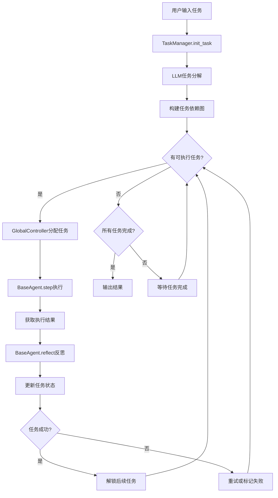

# 🏰 VillagerAgent 项目架构文档

> **VillagerAgent**: 基于图的多智能体框架，用于在 Minecraft 环境中协调复杂任务依赖关系  
> **发表于**: ACL 2024  
> **论文**: [arXiv:2406.05720](https://arxiv.org/abs/2406.05720)

---

## 📁 项目目录结构

```
VillagerAgent/
├── env/                    # 环境层 - Minecraft环境交互
├── pipeline/               # 管道层 - 核心控制逻辑
├── model/                  # 模型层 - LLM模型接入
├── type_define/            # 类型定义 - 图结构和任务定义
├── data/                   # 数据层 - 游戏数据和配方
├── rl_env/                 # 强化学习环境
├── doc/                    # 文档
├── img/                    # 图片资源
├── result/                 # 结果输出
├── example.py              # 示例代码
├── config.py               # 配置文件
├── start_with_config.py    # 批量测试启动脚本
├── js_setup.py             # npm依赖安装
└── requirements.txt        # Python依赖
```

---

## 🎯 核心架构图

```
┌─────────────────────────────────────────────────────────────────────┐
│                          用户任务 (User Task)                        │
└─────────────────────────────────────┬───────────────────────────────┘
                                      ▼
┌─────────────────────────────────────────────────────────────────────┐
│                    GlobalController (全局控制器)                      │
│  📍 pipeline/controller.py                                           │
│  • 任务分配给智能体                                                    │
│  • 监控任务进度                                                        │
│  • 处理任务完成/失败反馈                                               │
└────────────┬─────────────────────────────┬──────────────────────────┘
             │                             │
             ▼                             ▼
┌────────────────────────┐    ┌────────────────────────┐
│   TaskManager          │    │    DataManager         │
│   📍 pipeline/         │    │    📍 pipeline/        │
│      task_manager.py   │    │       data_manager.py  │
│  • 任务分解            │    │  • 环境状态管理         │
│  • 任务图构建          │    │  • 智能体状态管理       │
│  • 依赖关系管理        │    │  • 历史记录管理         │
│  • 子任务状态追踪      │    │  • 经验数据管理         │
└────────────┬───────────┘    └───────────┬────────────┘
             │                            │
             └──────────────┬─────────────┘
                            ▼
┌─────────────────────────────────────────────────────────────────────┐
│                      BaseAgent (基础智能体)                          │
│  📍 pipeline/agent.py                                                │
│  • step() - 执行任务动作                                             │
│  • reflect() - 任务反思                                              │
│  • idle_step() - 空闲时协助其他智能体                                 │
└─────────────────────────────────┬───────────────────────────────────┘
                                  ▼
┌─────────────────────────────────────────────────────────────────────┐
│                    VillagerBench (环境)                              │
│  📍 env/env.py                                                       │
│  • Minecraft 服务器交互                                              │
│  • Agent 注册和管理                                                  │
│  • 任务评分系统                                                      │
└─────────────────────────────────┬───────────────────────────────────┘
                                  ▼
┌─────────────────────────────────────────────────────────────────────┐
│                    Agent (Minecraft客户端)                           │
│  📍 env/minecraft_client.py                                          │
│  • 高级动作: navigateTo, MineBlock, place_item, craft...            │
│  • 低级API: 与 Mineflayer JS 服务器通信                              │
└─────────────────────────────────────────────────────────────────────┘
```

---

## 🔧 各层详细说明

### 1. Pipeline 层 (`pipeline/`)

核心控制逻辑层，包含 14 个文件：

| 文件 | 类/功能 | 说明 |
|------|---------|------|
| `controller.py` | `GlobalController` | 全局控制器，负责任务分配、执行和监控 |
| `controller_tiny.py` | 简化版控制器 | 轻量级控制器实现 |
| `agent.py` | `BaseAgent`, `AgentFeedback` | 单个智能体的行为逻辑（执行、反思、空闲协作） |
| `agent_save.py` | Agent状态保存 | 智能体状态持久化 |
| `task_manager.py` | `TaskManager` | 任务分解、图构建、依赖管理 |
| `data_manager.py` | `DataManager` | 环境/智能体/历史/经验数据管理 |
| `retriever.py` | `Retriever` | 信息检索器（RAG） |
| `utils.py` | 工具函数 | 公共工具函数 |
| `*_prompt.py` | Prompt模板 | 各模块的LLM提示词模板 |

#### GlobalController 核心方法

```python
class GlobalController:
    def __init__(self, llm_config, task_manager, data_manager, env)
    def run(self)                           # 主运行循环
    def execute_tasks(self)                 # 执行任务
    def assign_tasks_to_agents(self, result)  # 分配任务给智能体
    def process_completed_tasks(self)       # 处理完成的任务
    def update_task_status(self, task, status, detail)  # 更新任务状态
```

#### BaseAgent 核心方法

```python
class BaseAgent:
    def step(self, task: Task)              # 执行任务动作
    def reflect(self, task: Task, detail)   # 反思任务执行结果
    def idle_step(self)                     # 空闲时协助其他智能体
    def normal_step(self, task: Task)       # 标准执行步骤
    def local_step(self, task: Task)        # 本地模型执行步骤
    def rl_step(self, task: Task)           # 强化学习执行步骤
```

---

### 2. Environment 层 (`env/`)

Minecraft 环境交互层，包含 17 个文件：

| 文件 | 功能 |
|------|------|
| `env.py` | **VillagerBench** 主环境类，包含任务类型定义 |
| `minecraft_client.py` | **Agent** 类，Minecraft客户端，70+ 高级动作API |
| `minecraft_server.py` | Mineflayer JS 服务器管理 |
| `minecraft_server_fast.py` | 快速版服务器实现 |
| `env_api.py` | 环境API定义 (~117KB) |
| `minecraft_define.py` | Minecraft 数据定义 |
| `build_judger.py` | 建筑任务评判器 |
| `farm_craft_judger.py` | 农业任务评判器 |
| `escape_room_judger.py` | 逃脱室任务评判器 |
| `meta_judger.py` | 元任务评判器 |
| `auto_judger.py` | 自动评判器 |
| `llm_gen_judger.py` | LLM生成任务评判器 |

#### VillagerBench 任务类型

```python
class env_type:
    none = -1           # 无任务
    construction = 0    # 建筑任务
    farming = 1         # 农业任务
    puzzle = 2          # 逃脱室谜题
    auto = 3            # 自动生成任务
    meta = 10           # 元任务
    gen = 13            # 生成任务
```

#### Agent 高级动作 API (部分)

```python
class Agent:
    # 移动相关
    def navigateTo(player_name, x, y, z, emotion, murmur)
    def navigateToPlayer(player_name, target_name, emotion, murmur)
    def navigateToBuilding(player_name, building_name, emotion, murmur)
    
    # 物品操作
    def MineBlock(player_name, x, y, z, emotion, murmur)
    def place_item(player_name, item_name, x, y, z, emotion, murmur)
    def handoverBlock(player_name, target_player, item_name, count, emotion, murmur)
    
    # 扫描探索
    def scanNearbyEntities(player_name, item_name, radius, item_num, emotion, murmur)
    def fetchContainerContents(player_name, x, y, z)
    
    # 高级结构
    def erectDirtLadder(player_name, top_x, top_y, top_z, emotion, murmur)
    def layDirtBeam(player_name, x1, y1, z1, x2, y2, z2, emotion, murmur)
```

---

### 3. Model 层 (`model/`)

LLM 模型接入层，支持多种模型，包含 9 个文件：

| 文件 | 支持的模型/功能 |
|------|----------------|
| `abstract_language_model.py` | 抽象基类定义 |
| `init_model.py` | 模型初始化工厂 |
| `openai_models.py` | OpenAI GPT 系列 (GPT-4, GPT-3.5等) |
| `google_model.py` | Google Gemini |
| `zhipu_model.py` | 智谱 GLM |
| `huggingface_model.py` | HuggingFace Transformers 模型 |
| `vllm_model.py` | vLLM 本地高性能推理 |
| `utils.py` | 模型工具函数 |

#### 模型配置示例

```python
llm_config = {
    "api_model": "gpt-4-1106-preview",
    "api_base": "https://api.openai.com/v1",
    "api_key_list": ["sk-xxx", "sk-yyy"]  # 支持多Key轮换
}
```

---

### 4. Type Define 层 (`type_define/`)

核心数据结构定义，包含 4 个文件：

| 文件 | 类 | 功能 |
|------|-----|------|
| `graph.py` | `Task`, `Graph` | 任务节点和依赖图定义 |
| `task_summary_tree.py` | `TaskSummaryTree` | 任务摘要树结构 |
| `decomposed_summary_system.py` | `DecomposeSummarySystem` | 任务分解摘要系统 |

#### Task 类

```python
class Task:
    # 任务状态常量
    success = "success"
    failure = "failure"
    unknown = "unknown"
    running = "running"
    
    def __init__(self, name: str, content: dict):
        self.id = uuid.uuid4()       # 唯一标识
        self.name = name             # 任务名称
        self.content = content       # 任务内容
        self.status = "unknown"      # 任务状态
        self.agent = None            # 分配的智能体
        # ...
```

#### Graph 类 (基于 NetworkX)

```python
class Graph:
    def __init__(self):
        self.vertex = []             # 节点列表
        self.edge = []               # 边列表
        self.G = nx.DiGraph()        # NetworkX有向图
    
    def add_node(self, node: Task)
    def add_edge(self, start_node: Task, end_node: Task)
    def get_open_task_list(self)     # 获取可执行任务
    def check_graph_completion(self)  # 检查图是否完成
    def merge_at(self, sub_graph, node: Task)  # 子图合并
```

---

### 5. Data 层 (`data/`)

游戏数据资源，包含 19 个文件：

| 文件 | 大小 | 说明 |
|------|------|------|
| `blocks.json` | 863KB | Minecraft方块数据 |
| `items.json` | 149KB | Minecraft物品数据 |
| `recipes.json` | 837KB | 合成配方 |
| `building_blue_print.json` | **~103MB** | 建筑蓝图 |
| `farm_blue_print.json` | 221KB | 农场设计 |
| `farm_setting.json` | 359KB | 农场设置 |
| `escape_atom.json` | 39KB | 逃脱室谜题原子操作 |
| `animals.json` | 6KB | 动物数据 |
| `mcData.json` | 231KB | MC综合数据 |
| `goal_lib.json` | 16KB | 目标库 |

---

## 🔄 工作流程



### 详细流程步骤

1. **任务初始化**: `TaskManager.init_task()` 接收任务描述和相关文档
2. **任务分解**: LLM 将复杂任务分解为子任务，构建依赖图 (`Graph`)
3. **任务查询**: `TaskManager.query_subtask_list()` 获取当前可执行任务
4. **任务分配**: `GlobalController.assign_tasks_to_agents()` 将任务分配给空闲Agent
5. **任务执行**: `BaseAgent.step()` 调用Minecraft API执行具体动作
6. **状态反馈**: `BaseAgent.reflect()` 反思执行结果，判断成功/失败
7. **状态更新**: `GlobalController.update_task_status()` 更新任务状态
8. **依赖解锁**: 完成的任务自动解锁后续依赖任务
9. **循环执行**: 重复步骤3-8，直到所有任务完成或达到停止条件

---

## 🚀 快速开始

### 基本使用示例

```python
from env.env import VillagerBench, env_type, Agent
from pipeline.controller import GlobalController
from pipeline.data_manager import DataManager
from pipeline.task_manager import TaskManager
import json

if __name__ == "__main__":
    # 🌍 设置环境
    env = VillagerBench(env_type.construction, task_id=0, 
                        _virtual_debug=False, dig_needed=False)

    # 🤖 配置LLM
    api_key_list = json.load(open("API_KEY_LIST", "r"))["OPENAI"]
    llm_config = {
        "api_model": "gpt-4-1106-preview",
        "api_base": "https://api.openai.com/v1",
        "api_key_list": api_key_list
    }

    # 配置Agent模型
    Agent.model = "gpt-4-1106-preview"
    Agent.base_url = "https://api.openai.com/v1"
    Agent.api_key_list = api_key_list

    # 🔨 定义Agent工具
    agent_tool = [
        Agent.fetchContainerContents, 
        Agent.MineBlock, 
        Agent.place_item,
        Agent.navigateTo,
        Agent.handoverBlock
    ]

    # 📝 注册Agent
    env.agent_register(
        agent_tool=agent_tool, 
        agent_number=3, 
        name_list=["Agent1", "Agent2", "Agent3"]
    )

    # 🏃‍♂️ 运行环境
    with env.run():
        # 初始化管理器
        dm = DataManager(silent=False)
        dm.update_database_init(env.get_init_state())
        
        tm = TaskManager(silent=False)
        ctrl = GlobalController(llm_config, tm, dm, env)

        # 设置任务
        tm.init_task("Build a small wooden house with a door and windows.")

        # 🚀 运行控制器
        ctrl.run()
```

---

## ✨ 特色功能

| 功能 | 说明 |
|------|------|
| **多智能体协作** | 支持多个智能体并行执行任务，自动协调依赖 |
| **图结构任务管理** | 使用 NetworkX 管理任务依赖关系，支持复杂任务分解 |
| **实时对话** | 支持 Human-Agent 和 Agent-Agent 实时聊天交互 |
| **强化学习支持** | 集成 PPO 方法进行 LLM API 排序优化 |
| **多LLM支持** | 支持 OpenAI/Gemini/GLM/HuggingFace/vLLM 等 |
| **自动任务生成** | LLM 驱动的 AutoGen 任务，用于 Agent-tuning |
| **多种任务类型** | 建筑、农业、逃脱室谜题等多种任务类型 |

---

## 📋 环境要求

- **Python**: 3.8+
- **Node.js**: 需要 npm 安装 Mineflayer 依赖
- **Minecraft Server**: 1.19.2 版本
- **API Keys**: OpenAI / Gemini / GLM 等 (至少一个)

---

## 📚 相关文档

- [English README](README.md)
- [中文 README](READMEzh.md)
- [日本語 README](READMEja.md)
- [API Library](doc/api_library.md)
- [Minecraft Escape Room Benchmark](env/Minecraft_escape_room_benchmark.md)

---

## 📖 引用

```bibtex
@inproceedings{dong2024villageragent,
  title={VillagerAgent: A Graph-Based Multi-Agent Framework for Coordinating Complex Task Dependencies in Minecraft},
  author={Dong, Yubo and Zhu, Xukun and Pan, Zhengzhe and Zhu, Linchao and Yang, Yi},
  booktitle={Proceedings of the 62nd Annual Meeting of the Association for Computational Linguistics (ACL)},
  year={2024},
  url={https://arxiv.org/abs/2406.05720}
}
```

---

*文档生成时间: 2024-12-26*
