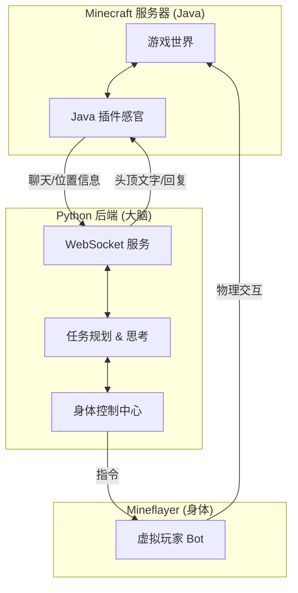

# MC_Servant 项目架构通俗讲解

欢迎！由于这个项目是由 AI 协助构建的，结构上融合了多种技术。为了让你能更好地掌控它，这篇文档将用通俗易懂的方式，带你理清整个项目的“经脉”。

## 1. 核心理念：三位一体

你可以把 `MC_Servant` 想象成一个完整的人，它由三个部分组成：

1.  **Java 插件（感官）**：负责“听”和“看”。它运行在 Minecraft 服务器内部，能最快地接收游戏信息。
2.  **Python 后端（大脑）**：负责“思考”。这里运行着大模型（LLM）和复杂的逻辑，决定机器人该做什么。
3.  **Mineflayer（身体）**：负责“行动”。这是一个基于 Node.js 的库，被 Python 操控着在游戏里跑跑跳跳、挖矿砍树。

### 架构图解

---

## 2. 深入细节：各司其职

### 第一部分：Java 插件 (The Senses)
*   **位置**: `MC_Servant/plugin`
*   **作用**：
    *   **传话筒**：当你在游戏里说话时，它会立刻把消息通过 WebSocket 传给 Python。
    *   **即时显示**：Python 如果想让机器人在头顶显示“正在思考...”，就是发指令给 Java 插件，利用 Hologram（全息文字）显示出来的。
    *   **精准定位**：虽然 Mineflayer 也能看位置，但在服务器内部的 Java 插件获取的数据往往更权威、更实时（特别是涉及到多世界传送时）。

### 第二部分：Python 后端 (The Brain)
*   **位置**: `MC_Servant/backend`
*   **这是最复杂的地方，也是项目的灵魂。**

#### 1. 怎么控制身体？ (`bot/mineflayer_adapter.py`)
我们没有直接写 Java 代码控制动作，也没有用 Python 原生库（因为 Python 的 MC 库不够成熟）。
**黑科技**：我们用了一个叫 `javascript` 的 Python 库，它能让我们在 Python 代码里直接通过 `require('mineflayer')` 调用 Node.js 的代码！
所以，虽然你在写 Python，底下跑的其实是成熟稳重的 Node.js Mineflayer 库。

#### 2. 怎么思考任务？ (`task/`)
我们采用了一种 **“栈式规划” (Stack-based Planning)** 的方法。想象一下叠盘子：
*   **目标**：“挖一块铁矿”。
*   **问题**：没稿子。
*   **解决**：Python 会自动发现这个问题，生成一个“制作木镐”的新任务，**叠**在原任务上面。
*   **再问题**：制作木镐需要木头。
*   **再解决**：再生成一个“砍树”的任务，**叠**在最上面。

于是，机器人会先执行最上面的“砍树”，做完后“盘子”拿走，露出下面的“制作木镐”，最后才是“挖铁矿”。这就叫**自愈能力**。

### 第三部分：协议通信 (`protocol.py`)
Python 和 Java 毕竟是两种语言，它们怎么交流？
我们定义了一套简单的 JSON 语言（类似于两个外国人用手势交流）：
*   `player_message`: "嘿，玩家在说话！" (Java -> Python)
*   `npc_response`: "告诉玩家这句话..." (Python -> Java)
*   `hologram_update`: "把头顶的字改成这个..." (Python -> Java)

---

## 3. 一个指令的奇幻漂流

假设你在游戏里对机器人说：**“去砍那棵树。”**

1.  **耳朵 (Java)** 听到了这句话，打包成 JSON 发给 **大脑 (Python)**。
2.  **大脑** 里的 **LLM (大模型)** 分析语义，明白你要它“伐木”。
3.  **大脑** 生成一个 `mine_tree` 的任务卡片，递给 **任务执行官 (Executor)**。
4.  **任务执行官** 检查任务，发现手里有斧头，条件满足。
5.  **任务执行官** 指挥 **身体 (Mineflayer)**：“走到坐标 (100, 64, 200)，然后挖掘方块。”
6.  **身体** 计算路径，避开岩浆，走到树前，挥动斧头。
7.  同时，**大脑** 告诉 **嘴巴 (Java)**：“在头顶显示‘正在砍树...’”。

---

## 4. 给领路人的看代码指南

如果你想修改代码，建议按这个顺序看：

1.  想改 **通信内容**？ 看 `backend/protocol.py`。
2.  想改 **机器人动作**？ 看 `backend/bot/actions.py`。
3.  想改 **任务逻辑**？ 看 `backend/task/executor.py`。
4.  想改 **游戏内显示**？ 去 `plugin/src/main/java/...` 找对应的 Java 监听器。

希望这份文档能帮你彻底搞懂这个 AI 助手的运作原理！
