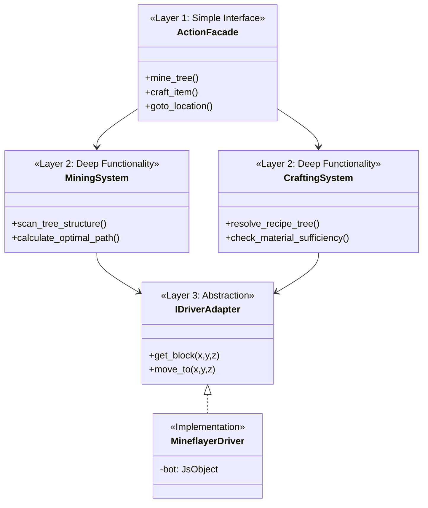

# Action 层重构架构设计文档

> **核心原则**：简单接口，深度功能，依赖抽象。

本文档描述了将庞大的 `MineflayerActions` 单体类重构为现代化、分层架构的设计方案。

## 1. 现状痛点

当前的 `actions.py` 在一个文件中混合了三个维度的逻辑，导致维护困难：
1.  **调度逻辑**：决定“先做什么再做什么”。
2.  **算法逻辑**：如“BFS 查找树木”、“合成配方计算”。
3.  **驱动逻辑**：与 `javascript` / `mineflayer` 库的底层交互。

这种“铁板一块”的结构违反了单一职责原则，使得扩展新功能（如支持新的挖矿策略）或替换底层库变得极为困难。

## 2. 三层架构模型 (The 3-Layer Architecture)

为了实现优雅的代码结构，我们将架构由上至下划分为三层。每一层只依赖它的下一层。



---

### 层级详解

#### 第一层：外观层 (L1 - Facade)
> **原则：简单接口 (Simple Interface)**
> **职责：统一调度，对外暴露极其简单的 API。**

*   这一层**没有任何复杂逻辑**。它不应该包含 `while` 循环、数学计算或复杂的条件判断。
*   它看起来应该像是一份“说明书”，告诉调用者有哪些功能可用。
*   **示例职责**：
    *   接收 `mine(block_name)` 请求。
    *   调用 `ScanningSystem` 找到目标。
    *   调用 `MiningSystem` 执行挖掘。
    *   返回最终结果（成功/失败）。

#### 第二层：逻辑系统层 (L2 - Logic Systems)
> **原则：深度功能 (Deep Functionality)**
> **职责：处理核心业务算法，纯 Python 实现。**

*   这一层是“大脑”，负责所有复杂的思考过程。
*   它不知道“Mineflayer”的存在，它只操作抽象的数据模型。
*   **组件划分**：
    *   `MiningSystem`：负责 BFS 搜索连通方块、计算最佳挖掘站位。
    *   `CraftingSystem`：负责解析复杂的合成配方树、计算缺失材料、处理替代材料（Tags）。
    *   `MovementSystem`：负责寻路策略、防卡死逻辑、螺旋挖掘脱困逻辑。
    *   `PerceptionSystem`：负责实体筛选、威胁评估、环境特征提取。

#### 第三层：驱动适配层 (L3 - Driver Adapters)
> **原则：依赖抽象 (Depend on Abstraction)**
> **职责：脏活累活，隔离底层库细节。**

*   这一层是“防腐层”，专门处理不稳定的外部依赖（如 `javascript` 库的类型转换、异常捕获）。
*   它对外暴露标准的 Python 接口（如 `IDriverAdapter`）。
*   **实现细节**：
    *   如果未来从 `mineflayer` 切换到其他库，只需要重写这一层，上面的 L1 和 L2 完全不需要改动。
    *   负责处理所有的 `asyncio` 桥接和线程安全性问题。

---

## 3. 目录结构规划

```text
backend/bot/
├── actions/                  # L1: 外观层入口
│   ├── __init__.py           # 暴露 ActionFacade
│   └── facade.py             # 调度逻辑
├── systems/                  # L2: 逻辑系统层
│   ├── mining.py             # 挖掘算法
│   ├── crafting.py           # 合成算法
│   ├── perception.py         # 感知算法
│   └── movement.py           # 移动策略
└── drivers/                  # L3: 驱动适配层
    ├── interfaces.py         # 定义 IDriverAdapter 接口
    └── mineflayer/           # 具体实现
        ├── driver.py         # Mineflayer 具体实现
        └── utils.py          # JS 类型转换工具
```

## 4. 收益总结

1.  **可测试性**：L2 层的复杂算法（如配方计算）变成纯 Python 逻辑，可以直接编写单元测试，不需要启动 Minecraft 游戏或 Mock 庞大的 Mineflayer 对象。
2.  **可维护性**：每个文件专注于单一领域。修 bug 时，只需关注那个领域的几十行代码。
3.  **可扩展性**：新增一个“钓鱼”功能，只需加一个 `FishingSystem` 并在 Facade 里注册，不会干扰现有的挖矿代码。
4.  **优雅**：代码读起来更顺畅，每一层的抽象级别一致，符合人类思维习惯。


我看了 actions.py 的实现和你提出的 Facade + Components + 抽象驱动方案，方向是对的，而且和现
  有 IBotActions 的设计初衷一致。不过要落地，需要先正视现存的结构问题和抽象缺口。

  Findings

  - 高：MineflayerActions 同时承担 Facade 和所有深度逻辑（BFS、采集、手工合成、窗口操作），违
    反“简单接口/深度功能”分层，维护和测试都很难。MC_Servant/backend/bot/actions.py:131、
    MC_Servant/backend/bot/actions.py:864、MC_Servant/backend/bot/actions.py:1546
  - 高：逻辑层大量直接操作 self._bot、pathfinder、collectBlock、clickWindow 等 JS API，依赖倒
    置完全失效，一旦替换 Mineflayer 基本等于重写。MC_Servant/backend/bot/actions.py:139、
    MC_Servant/backend/bot/actions.py:491、MC_Servant/backend/bot/actions.py:1996
  - 中：算法逻辑直接使用 JS Proxy 类型和 mineflayer 数据结构（Vec3、recipesAll、
    currentWindow、slots），导致“抽象层”很难不泄漏实现细节。MC_Servant/backend/bot/
    actions.py:1546、MC_Servant/backend/bot/actions.py:1996
  - 中：进度计时、线程管理、超时/重试等横切关注点散落在动作函数里，抽取到系统层时很容易出现行
    为不一致。MC_Servant/backend/bot/actions.py:88、MC_Servant/backend/bot/actions.py:181、
    MC_Servant/backend/bot/actions.py:491
  - 中：测试只覆盖上层流程与 ActionResolver/Runner，几乎没有对 mining/crafting 算法的单元测
    试，重构后回归风险高。MC_Servant/backend/tests/test_universal_runner.py

  Open questions / assumptions

  - 你的 IWorldInteraction 只涵盖 get_block / click_slot 太窄，实际还需要 find_block、
    get_entities、navigate、dig、equip、open_window、craft 等能力；否则 Facade 仍会泄漏
    mineflayer API。
  - 抽象驱动要不要是 async？现在大量是同步 JS 调用 + 线程包裹，若不统一成 async API，很难做一
    致的取消/超时策略。
  - 组件之间如何共享状态（进度计时、后台线程、mcData）？这些是跨系统的“runtime context”，需要
    明确归属。

  结论
  方案方向正确，但需要先补齐抽象边界与数据模型（Block/Item/Inventory/Window）再拆分系统，否则
  只是“挪文件”，耦合不会降。

  建议的落地顺序

  1. 先引入 NativeDriver/IWorldInteraction 抽象（含 async API + 数据模型），用
     MineflayerDriver 适配现有 _bot；MineflayerActions 先改成只调 driver。
  2. 抽出 MiningSystem / CraftingSystem / MovementSystem，把 BFS 与配方推导迁出 actions.py，
     仅通过 driver 访问世界。
  3. 补单元测试：BFS 树识别、配方选择/缺料推导、手工合成流程（用 fake driver 驱动）。