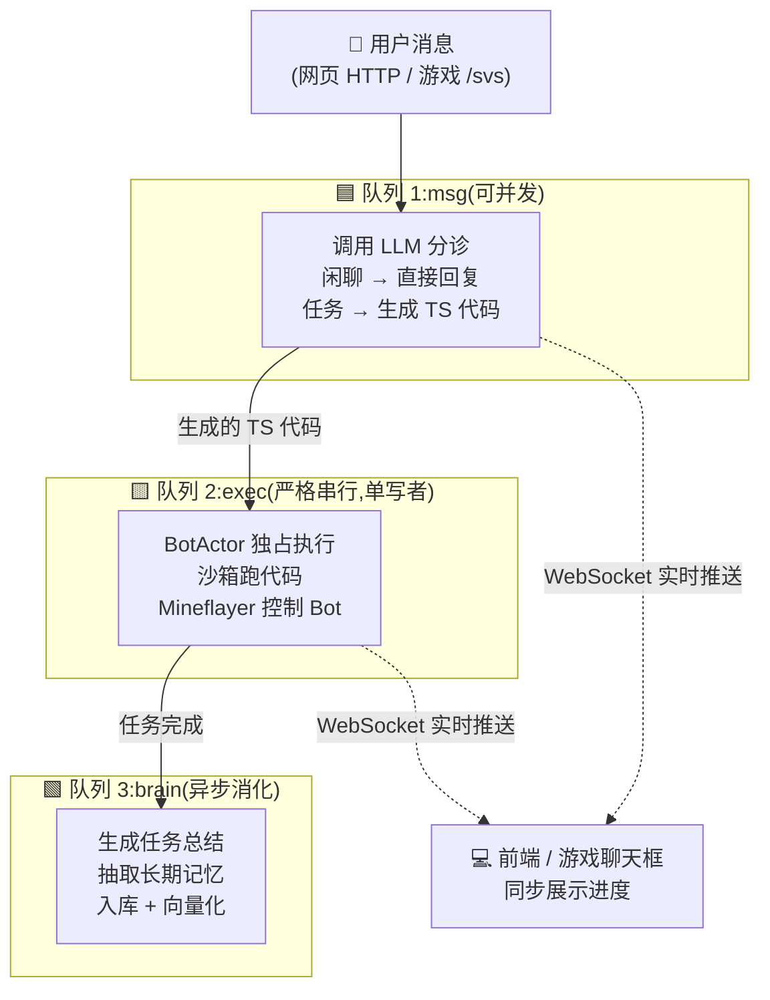
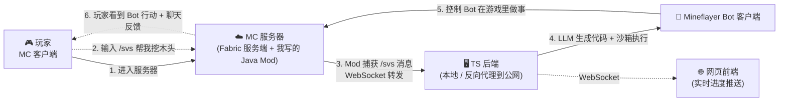

# MC_Servant

> **在 Minecraft 里养一个能听懂自然语言的 Bot。**
> 你说一句话,LLM 把它翻译成可执行的 TypeScript 代码,Bot 走过去把事情做完。

---

## 🎬 30 秒看懂

```
玩家在游戏聊天框输入:  /svs 帮我挖 10 个木头送过来

  ↓ (Java Mod 捕获)

LLM 生成一段 TypeScript 代码:
  const trees = await observe.findTrees({ range: 20 });
  for (const tree of trees) {
    await ensure.reach(tree.position);
    await ensure.mine(tree.position, { tool: "axe" });
    if (await inventory.countOf("wood") >= 10) break;
  }
  await ensure.giveTo(player, "wood", 10);

  ↓ (沙箱执行 + Mineflayer 控制)

Bot 走过去砍树 → 走回来 → 把木头丢给你 → 在聊天栏汇报"完成"
```

**整个过程:1 次 LLM 调用 + 1 段代码 + 全自动执行。**

---

## ✨ 为什么这个项目不一样

### 亮点 1:Code-as-Plan —— 让 LLM 写代码,而不是返回 JSON

**这是项目最大的差异化。**

传统 Agent 用 Function Calling:每决策一步都要调一次 LLM,LLM 返回 JSON 说"我要调 `goTo` 工具,参数是 (10, 20)",宿主程序解析后执行,然后再调下一次 LLM……

**我的方案:让 LLM 一次性写出一整段带控制流的 TypeScript 代码,沙箱整段执行。**

```typescript
// ❌ 传统 Function Calling:挖 10 个木头需要 10+ 次 LLM 调用
// LLM → {"tool":"findTrees"} → 执行 → 返回结果给 LLM →
// LLM → {"tool":"goTo", "args":{"x":10,"z":20}} → 执行 → 返回给 LLM →
// LLM → {"tool":"mine"} → 执行 → 返回给 LLM →
// LLM → ... 重复 N 次,每次都消耗 token、每次都有延迟

// ✅ Code-as-Plan:1 次 LLM 调用,生成完整可执行计划
const trees = await observe.findTrees({ range: 20 });
for (const tree of trees) {
  await ensure.reach(tree.position);
  await ensure.mine(tree.position, { tool: "axe" });
  if (await inventory.countOf("wood") >= 10) break;  // ← 条件控制
}
await ensure.giveTo(player, "wood", 10);
```

**带来的好处:**

| 维度 | 传统 Function Calling | Code-as-Plan |
|---|---|---|
| LLM 调用次数 | N 次(每步一次) | 1 次(一次性出整套计划) |
| Token 消耗 | 高 | **低** |
| 延迟 | 高 | **低** |
| 复杂逻辑(if/for/嵌套) | 难以表达 | **天然支持** |
| 失败回滚 | 单步回退 | **整段回滚或断点续跑** |

> **不是我发明的:** 这条路径在学术圈有 Voyager (NVIDIA 2023) 和 CodeAct (2024) 等论文背书,本项目是这条路径的一个工程化生产实践。

---

### 亮点 2:三队列异步分层 —— 不是 Demo,是生产级架构



**每个队列解决一个明确的工程问题:**

- **队列 1(msg):并发** —— 多个用户消息可以同时调 LLM,不互相阻塞
- **队列 2(exec):串行** —— 同一时刻只有一个任务能操作 Bot,**避免"砍树砍一半被插队去挖矿"的并发冲突**
- **队列 3(brain):后台** —— 任务完成后的总结/记忆/入库不拖累主链路,异步消化

**这三个队列之间用 Redis + BullMQ 串联,这是大部分 Agent Demo 不会做的工程化设计。**

---

### 亮点 3:完整双端通信链路 —— 从游戏内到后端的闭环

这是项目最容易被低估的工程量。**让玩家在游戏里输入一句话能驱动后端,需要打通 4 层通信:**



**通信链路拆解:**

1. **玩家** 打开 MC 客户端,连接到 **MC 服务器**(运行 Fabric + 我自己写的 Java 插件)
2. 玩家在游戏聊天框输入 `/svs <消息>`,**Java Mod 捕获这条带前缀的消息**
3. Mod 通过 **WebSocket** 把消息转发到 **TS 后端**(可以本地跑,也可以通过反向代理暴露公网)
4. TS 后端 → LLM 分诊 → 生成代码 → 沙箱执行 → 通过 Mineflayer 控制 Bot
5. **Bot 作为另一个 MC 客户端** 连接到同一个 MC 服务器,在游戏里实际做事
6. 玩家在游戏中看到 Bot 行动,同时通过聊天栏接收 Bot 的反馈

> **为什么要写自己的 Java Mod?**
> MC 原生没有"把聊天消息发到外部服务"的能力。Fabric 提供的 networking API 只能用于 MC 客户端 ↔ MC 服务端的内部通信,要打通"游戏 ↔ 外部 TS 后端",**必须自己写服务端 mod 来桥接**。这个 Mod 我用 OkHttp WebSocket 实现,封装在 `ServerBridgeTransport` 接口背后,生产环境运行稳定。

---

## 📊 真实指标(不是 Demo)

最近 50 个综合任务的生产数据:

| 指标 | 数据 |
|---|---|
| 任务平均完成步数 | **3 步** |
| 单任务平均执行耗时 | **23.1 秒** |
| Plan 严格解析成功率 | **100%** |
| Code-only 解析成功率 | **100%** |
| 门禁失败率 | **0%** |
| 静态预检失败率 | **0%** |
| 执行失败 / 人工干预 / 中断 | **0 / 0 / 0** |
| 累计 LLM 输入 token | 272,246 |
| 累计 LLM 输出 token | 8,203 |

**分阶段 LLM 调用延迟(最近 50 次):**

| 阶段 | 平均延迟 |
|---|---|
| Triage(意图分诊) | 1.59s |
| Plan(代码生成) | 2.35s |
| Chat(闲聊回复) | 3.72s |
| Report(任务总结) | 1.47s |

---

## 🤔 为什么选 Minecraft 做 Agent 的试验场?

这不是玩游戏。Minecraft 是目前**学术圈公认的 LLM Agent 训练最佳沙盒**,原因有四:

1. **真·长程任务**
   挖一颗钻石需要 10+ 步前置(挖木 → 做工作台 → 木镐 → 挖石 → 石镐 → 挖铁 → 烧炼 → 铁镐 → 下矿 → 避岩浆 → 挖钻),任何一步失败整条链就断。这是真实世界 Agent 面临的核心难题(long-horizon task),**比"查天气、订机票"这类一步式任务有质的不同**。

2. **动态环境,强迫 Agent 具备恢复能力**
   MC 世界不是静态的:天黑出怪、洞穴会塌、Bot 会饿、岩浆会烧死你。Agent 必须能**感知环境变化并自我恢复**——这是 Demo 级 Agent 最容易翻车的地方,也是工程化的核心难点。

3. **客观可验证的成功信号**
   Bot 挖到钻石没?背包里有就是有,没有就是没有。**没有人为评分的歧义**,效果评估有清晰 reward。

4. **学术圈共同基准**
   **Voyager(NVIDIA, 2023)** 是用 MC 做 LLM Agent 的开山论文,整个领域有共同的基准和评测语言。在 MC 上做出的工程实践,可以直接对话学术圈的研究。

---

## 🛠 技术栈一览

**后端核心(TypeScript 单进程):**
Node.js · Fastify · Socket.io · Redis + BullMQ · PostgreSQL + pgvector · Drizzle ORM · isolated-vm · Mineflayer · minecraft-data · Zod

**Mod 端(Java 17):**
Fabric Loader · Fabric API · OkHttp WebSocket · Brigadier · LuckPerms(软依赖)

**部署:**
Docker Compose · WSL2(开发) · 反向代理上公网

---

<details>
<summary><h2 style="display:inline">🚀 快速开始(点击展开)</h2></summary>

### 环境要求

- WSL2 + Docker Engine(原生,**不要** Docker Desktop)
- Node.js 20+,pnpm(由 Corepack 管理)
- Java 17(仅构建 mod 时需要)
- 一个跑着 Fabric 1.20.4 的 MC 服务端

### 1. 启动基础设施 + TS Core(开发模式)

```bash
./dev-infra.sh                 # 起 PostgreSQL + Redis 容器
cd ts-core
pnpm install
cp .env.example .env           # 编辑 LLM_*, MC_*, SERVER_BRIDGE_* 等
set -a && source .env && set +a
pnpm db:migrate                # 首次需要
pnpm dev                       # tsx watch src/main.ts
```

### 2. 全 Docker 启动(验收模式)

```bash
./start-ts-core.sh
./stop-ts-core.sh
```

### 3. 闲聊手测

```bash
curl -X POST http://127.0.0.1:3000/api/message \
  -H 'content-type: application/json' \
  -d '{"bot_id":"local-bot","message_id":"msg-1","content":"你今天心情怎么样"}'
```

### 4. 构建并部署 Fabric Mod

```bash
cd plugin
./gradlew build
# 产物:plugin/build/libs/mcservant-0.4.0.jar
# 复制到 MC 服务端的 mods/ 目录
```

启动 MC 服务端时注入桥接配置:

```bash
java \
  -Dmcservant.bridge.enabled=true \
  -Dmcservant.bridge.url=ws://127.0.0.1:3000/ws/server-bridge \
  -Dmcservant.bridge.accessToken=<token> \
  -jar fabric-server-launch.jar nogui
```

游戏内执行 `/svs hello`,Bot 应在聊天栏回复。

</details>

<details>
<summary><h2 style="display:inline">📂 仓库结构(点击展开)</h2></summary>

```
MC_Servant/
├── ts-core/              # ⭐ 主核心:TypeScript 单进程
│   ├── src/
│   │   ├── app/          # 组合根:依赖装配、启停顺序
│   │   ├── core-ports/   # 横切端口契约
│   │   ├── domain/       # 领域类型与不变量
│   │   ├── runtime/      # BotActor 状态机 + 中断协议
│   │   ├── conversation/ # 意图分诊 + LLM 客户端
│   │   ├── workers/      # ConversationWorker / BotWorker / BrainWorker
│   │   ├── sandbox/      # isolated-vm + 语义 API + host bridge
│   │   ├── skills/       # goTo / mine / cutTree / collect / craft / place / equip
│   │   ├── observation/  # 环境快照 + 威胁检测
│   │   ├── world-model/  # minecraft-data 确定性查询
│   │   ├── interfaces/   # Fastify API + Socket.io + game-chat
│   │   ├── diagnostics/  # JSONL 日志 + LLM transcript
│   │   └── db/           # Drizzle schema + PG 连接
│   └── Docs/             # 设计文档
│
├── plugin/               # Fabric 服务端 Mod(Java 17)
│   ├── src/main/java/com/mcservant/
│   │   ├── MCServantMod.java
│   │   ├── bridge/       # WebSocket 桥接到 TS 后端
│   │   └── command/      # /svs <message> 命令注册
│   └── README.md
│
├── compose.yaml          # PostgreSQL + Redis + ts-core 容器编排
├── dev-infra.sh          # 只起 PG + Redis,本机 pnpm dev 跑 ts-core
├── start-ts-core.sh      # 全 Docker 启动(验收模式)
└── stop-ts-core.sh
```

</details>

<details>
<summary><h2 style="display:inline">📐 深入架构(点击展开)</h2></summary>

### 三层响应模型

```
┌─ 第 1 层:硬编码反射(<200ms) ──────────────────┐
│  威胁检测、安全断开、紧急中断 —— 不调 LLM       │
└────────────────────────────────────────────────┘
              ↓
┌─ 第 2 层:LLM 轻判断(1-5s) ─────────────────────┐
│  意图分诊:这是闲聊?任务?需要规划吗?           │
└────────────────────────────────────────────────┘
              ↓
┌─ 第 3 层:LLM 深推理(5-30s) ────────────────────┐
│  生成完整任务计划:TypeScript 代码 + 控制流     │
└────────────────────────────────────────────────┘
```

**核心思想:不是所有事都要喂给最贵的 LLM。** 简单事用规则、复杂事用 LLM 轻判断、真·任务才用 LLM 深推理生成代码。

### 沙箱安全模型

LLM 生成的代码不能直接 `eval`,会有安全和稳定性问题。本项目用 **isolated-vm** 在 V8 隔离堆中执行:

- 代码只能调用顶层语义 API(如 `ensure.mine`、`observe.findTrees`),无法访问 Node.js 内置模块
- 所有工具调用经过 **JSON Schema 工具契约** 校验参数
- 失败码分类(`UNKNOWN_TOOL` / `INVALID_ARGS` / `RUNTIME_ERROR` / `TIMEOUT` 等)
- 静态预检:代码进入沙箱前先做语法和调用合法性检查

### 单写者 BotActor

**任意时刻只有一个 BotActor 实例可以操作 Bot。** 这通过 exec 队列的严格串行 + BotActor 内部状态机共同保证。

中断协议:`botActor.interrupt(reason)` 是所有中断信号的唯一收口,基于 AbortController 实现,signal 穿透到沙箱每一步,确保中断在亚秒级生效。

### 混合 RAG 与多层记忆

| 检索层 | 实现 | 用途 |
|---|---|---|
| 关键词检索 | PostgreSQL FTS | 精确名词、命令 |
| 向量检索 | pgvector | 语义召回 |
| 融合重排 | RRF (Reciprocal Rank Fusion) | 综合排序 |

记忆分四层:**历史任务、对话摘要、长期资产、环境上下文**,为 Plan 生成提供可追溯的上下文。

</details>

<details>
<summary><h2 style="display:inline">📚 文档导航(点击展开)</h2></summary>

设计文档全部在 `ts-core/Docs/`,按依赖顺序阅读:

| 序号 | 文档 | 内容 |
|---|---|---|
| 0 | `agent.md` | 新人入口 |
| 1 | `01_ARCHITECTURE.md` | 七层架构、三队列、约束、模块边界 |
| 2 | `02_RUNTIME_SPEC.md` | BotActor 状态机、中断协议、单写者模型 |
| 3 | `03_SANDBOX_SPEC.md` | isolated-vm、语义 API、host bridge、安全边界 |
| 4 | `04_CONVERSATION_SPEC.md` | 意图分类、Prompt 设计、代码生成约束 |
| 5 | `05_DATA_SPEC.md` | Drizzle schema、JSONL、pgvector、冷热分离 |
| 6 | `06_AGENTIC_MINE_IRON_SPEC.md` | 挖铁闭环、技能沉淀 |
| 7 | `07_EVAL_SPEC.md` | LLM 离线 eval + 生产指标 JSONL 契约 |
| - | `WORKFLOW.md` | Planner A / Coder B / Reviewer C 三角色协作 |
| - | `ENGINEERING_PRINCIPLES.md` | 高内聚 / 低耦合 / DRY / SOLID 评审标准 |
| - | `PROGRESS.md` | 已完成任务索引 |

Mod 端文档见 `plugin/README.md` 与 `plugin/BUILD.md`。

</details>

<details>
<summary><h2 style="display:inline">🔧 常用命令(点击展开)</h2></summary>

### TS Core(在 `ts-core/` 下)

| 用途 | 命令 |
|---|---|
| 安装 | `pnpm install` |
| 类型 / Lint / 测试 | `pnpm typecheck` / `pnpm lint` / `pnpm test` |
| 开发 / 构建 / 启动 | `pnpm dev` / `pnpm build` / `pnpm start` |
| 数据库迁移 | `pnpm db:generate` / `pnpm db:migrate` |
| 循环依赖检查 | `pnpm dep:cycles` |
| LLM 评估 | `pnpm eval:llm` |
| 生产指标汇总 | `pnpm metrics:summary` |

### Fabric Mod(在 `plugin/` 下)

| 用途 | 命令 |
|---|---|
| 构建 | `./gradlew build` |
| 本地联调假服务 | `python3 scripts/ws-debug-server.py` |

</details>

<details>
<summary><h2 style="display:inline">❓ 常见问题排查(点击展开)</h2></summary>

| 现象 | 检查 |
|---|---|
| 握手被拒 | `SERVER_BRIDGE_ACCESS_TOKEN` 与 mod `mcservant.bridge.accessToken` 是否一致 |
| 协议不兼容 | TS Core 与 mod 双方升级后重启 |
| 心跳超时 | replay 出现 `server_bridge.heartbeat_timeout`,mod 自动按退避重连 |
| EasyAuth 登录失败 | `MC_EXTERNAL_AUTH_SECRET` 是否正确 |
| `world_ready=false` | MC 服务端是否允许该用户名进入世界 |
| 启动期 PG / Redis 失败 | 端口、密码、容器健康状态 |
| Bot 不动但日志正常 | 检查是否被 `intent_epoch` 校验丢弃(新意图覆盖了旧计划) |

</details>

---

## 📬 联系

GitHub: [@HCID274](https://github.com/HCID274)

> 这是一个独立开发项目,从设计到实现到部署全部由我一人完成。如果你看到这里觉得有意思,欢迎 Star 或 Issue 交流。