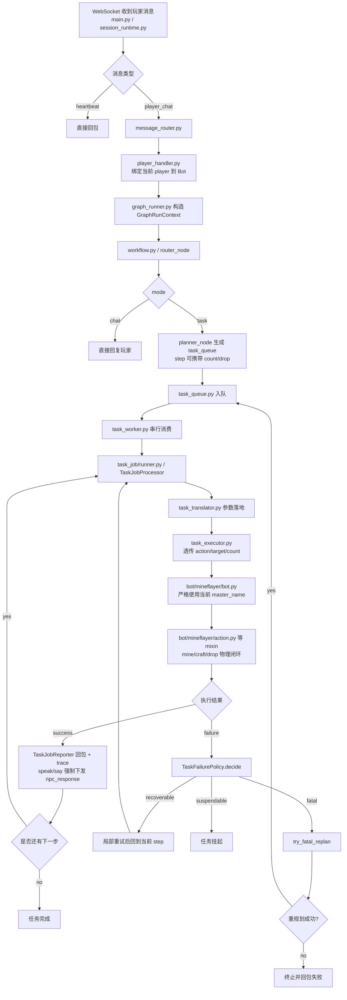
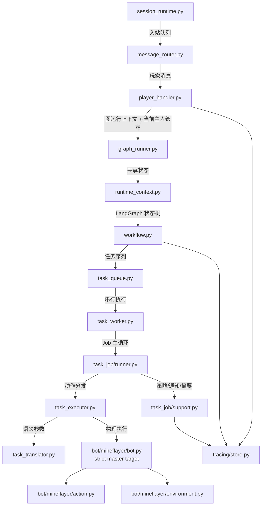
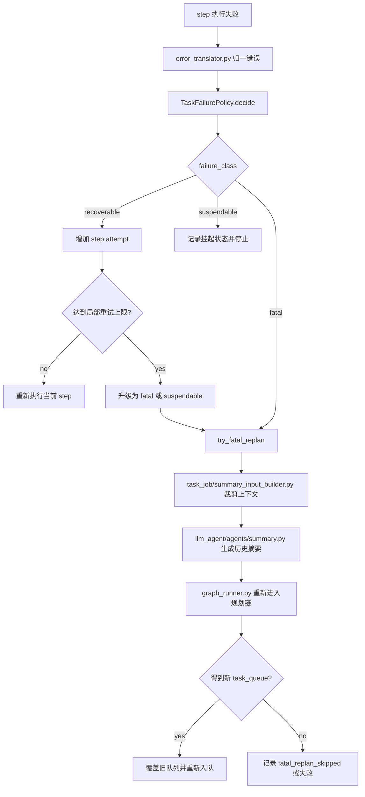

# Agent 状态流转图

本文单独描述当前 Agent 从收包到执行结束的状态流、关键代码落点，以及失败后的重试/挂起/重规划机制。

## 主状态流

## 状态职责映射

## 重试与重规划流

## 当前关键实现点

- 收包与会话调度
  - `backend/main.py`
  - `backend/websocket/session_runtime.py`
  - `backend/application/handlers/message_router.py`
- 决策与规划
  - `backend/application/handlers/player_handler.py`
  - `backend/application/services/graph_runner.py`
  - `backend/graph/runtime_context.py`
  - `backend/graph/workflow.py`
  - 工作台策略已收口为“`tool_context` 提供事实、Planner 明确产出 `craft/place crafting_table` 链”，graph 层不再额外做工作台链路诊断
- 任务执行
  - `backend/execution/task_queue.py`
  - `backend/execution/task_worker.py`
  - `backend/application/services/task_job/runner.py`
  - `backend/application/services/task_job/support.py`
  - `backend/execution/task_executor.py`
  - `backend/grounding/task_translator.py`
  - 当前交付链要求 Planner 产出 `move_to -> drop`，并把 `count` 一路透传到执行层
  - 普通 task 的 `speak/say` 不再只停留在 `task_executor.py` 的 `spoken_text` 结果里，而是由 `task_job/runner.py -> TaskJobReporter` 强制转成插件 `npc_response`
  - `player_handler.py` 与 `task_job/runner.py` 会在每次会话/任务启动时把当前 `player` 绑定到 Bot
- 物理动作与环境感知
  - `backend/bot/mineflayer/bot.py`
  - `backend/bot/mineflayer/base.py`
  - `backend/bot/mineflayer/action.py`
  - `backend/bot/mineflayer/environment.py`
  - `backend/bot/mineflayer/lifecycle.py`
  - `drop` 通过 `toss/tossStack` 真实交付，`mine` 通过循环采集支持数量目标；交付前 `drop` 会先朝向当前绑定主人
  - `lifecycle.py` 在插件初始化阶段会同时装配 `collect_watchdog_helper.js` 与 `stair_mining_helper.js`
  - `craft` 在检测到 3x3 配方时只会复用附近已有工作台；如果 Planner 漏掉 `place crafting_table`，执行层会直接返回 `MissingCraftingTable`，由重规划补齐链路
  - `craft.precheck` 会补充 `selected_via` 诊断字段，明确本次配方是 `direct_without_table / direct_with_table / fallback / none` 哪条路径命中的，避免单看 `recipes_all_count` 误判
  - `tool_context.workstations.nearby_crafting_table` 现在优先来自 `env_snapshot` 的精确近距扫描，不再只靠 `nearby_blocks` 摘要，减少“主人脚边明明有工作台却又重新造一个”的误判
  - 当 `recipesFor()` 因 tag/背包同步问题返回空时，`action.py` 会先做一次库存刷新，再记录 `craft.precheck` 与 `craft.recipe_fallback` 日志；真正的 family/tag 配方选择下沉到 `backend/bot/mineflayer/assets/craft_recipe_helper.js`，由 JS 侧直接 patch Mineflayer 原生 Recipe（含 `delta` / `inShape`），避免 Python 猜测 JS Recipe 结构
  - `place` 在 `equip` 成功后会先给服务端一个很短的同步窗口，再围绕 bot 当前脚下做半径 2、上下 3 层的 3D 空间扫描；只有目标为空气、下方有支撑面且不与 bot 脚下/头顶占用格重叠的候选点才会进入尝试队列，并按距离从近到远逐个 `placeBlock`
  - `mine` 在进入 `collectBlock` 前会先显式调用 `equipForBlock` 切到可挖目标的最佳工具；`mine.precheck` 会记录当前主手、`canHarvest` 与预期掉落，便于区分“石镐没做出来”和“石镐做出来但没切到手上”两类问题
  - `mine` 的接近执行现在有两条分支：如果资源 profile 属于 `ore_vein`，或目标与 bot 的 Y 轴高度差绝对值大于 3，就走 `backend/bot/mineflayer/assets/stair_mining_helper.js` 做 3D BFS 楼梯开路；否则继续走 `collectBlock` watchdog
  - `mine` 的实际阻塞执行已下沉到 `backend/bot/mineflayer/assets/collect_watchdog_helper.js`，且 Python 调该 helper 时显式使用 `timeout=None` 解除桥接默认 10s 限制：只要 bot 坐标仍在变化、背包任意物品计数发生变化，或世界里观测到任意方块被破坏/替换，就视为仍有进展；仅当这些信号都静默 7 秒时才返回 `MineStalledTimeout`
  - 楼梯采矿执行成功后，`action.py` 仍复用现有 post_collect / 掉落补拣 / inventory refresh 闭环；失败时会把 `stair_mining` 诊断 JSON 一并挂进 `BotActionError.extra`
  - cluster 选矿不会再盲信资源缓存里的 `selected_block`：`environment.py` 会对每个候选再做一次 live `blockAt` 校验；若现场已变 `air` 或被替换成别的块，会把该坐标加入 failed block 并继续选同 cluster 的下一个候选
  - 某轮采矿一旦确认成功，`action.py` 会立即刷新一次资源缓存再清理失败记忆，避免“刚挖空的旧矿点快照”在下一轮 count 采集中又被选回来
  - 高垂直差的楼梯采矿会按状态搜索规模额外放大 `horizontalPadding / verticalPadding / maxNodes`，降低 `stair_mining_helper.js` 在 spiral 模式下过早撞上 `max_nodes_reached`
  - 采矿前的工具守门现在以 `equipForBlock(requireHarvest=true)` 为准；楼梯采矿 JS helper 也不再吞掉 `equipForBlock` 失败。缺少合格工具时统一上抛 `NoItem`，由执行层翻译成 `no_required_tool`
  - `error_translator.py` 现在把 `no_required_tool` 归类为 `fatal`，让非 quick task 直接走重规划，而不是继续做局部重试
  - `BlockBrokenNoCollection` 路径会把当前矿点加入 failed block 集合，避免“矿已经变空气，但下一次局部重试还继续选回同一个坐标”
  - 一旦 JS IPC 已出现 `Timed out accessing` / `BrokenBarrierError`，`action.py` 会熔断后续 `inventory/entity/position` 读取，避免异常后再因状态探测把 Worker 拉崩
  - `movement.py` 的 `navigate_relative/look_at_eyes` 只认当前绑定主人的实时实体，不再退化为任意在线玩家；玩家句柄查找兼容 JS `players` 容器，不再假设存在 Python `dict.get()`
  - `navigate_relative` 不再 `setGoal()` 后秒返回，而是走 `pathfinder.goto(goal, timeout=None)` 阻塞等待，再由 Python 外层业务超时中断
- 留痕与复盘
  - `backend/tracing/store.py`
  - `backend/tracing/storage/repository.py`
  - `backend/tracing/storage/transcript_writer.py`
  - `backend/application/services/task_job/summary_input_builder.py`

## 当前重试机制摘要

- 同一 Bot 的任务始终串行执行，避免物理动作并发冲突。
- 单步失败先进入 `TaskFailurePolicy.decide(...)`，按 `recoverable / suspendable / fatal` 分流。
- `recoverable` 失败优先做局部重试，不立刻打断整条任务。
- `fatal` 失败会通过 `try_fatal_replan(...)` 重新构造上下文，只重跑规划链，不篡改旧 run 历史。
- 历史上下文进入重规划前，先经过 `task_job/summary_input_builder.py` 与 `llm_agent/agents/summary.py` 压缩，避免把整段长日志原样塞回 Planner。
