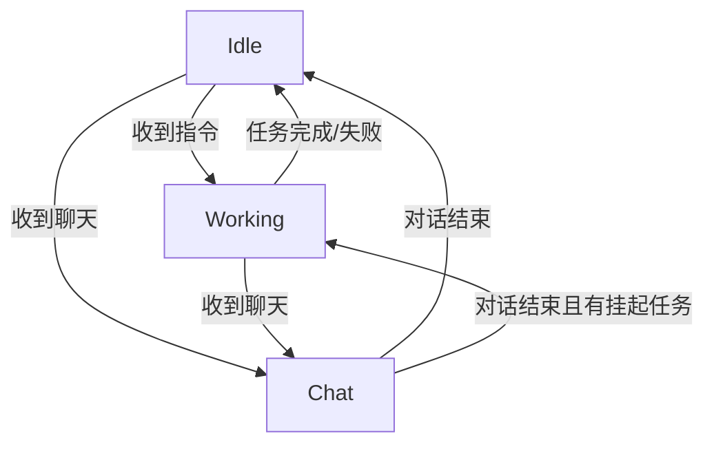

# State 模块文档

`backend/state/` 目录实现了 Bot 的有限状态机 (FSM) 和状态管理系统。它决定了 Bot 在宏观层面的行为模式（如是该闲聊、该干活还是该睡觉）。

## 核心组件

### 1. `machine.py` - 状态机 (StateMachine)
-   **职责**: 管理 Bot 的当前状态，处理状态流转。
-   **机制**:
    -   接收外部事件（如聊天、Tick）。
    -   调用当前状态的 `on_event` 方法处理事件。
    -   执行状态切换逻辑 (`transition_to`)。
    -   驱动状态的 `tick` 循环。

### 2. `states.py` - 具体状态实现
定义了 Bot 的各种状态类，均继承自 `State` 基类：
-   `IdleState`: 空闲状态。等待指令，或进行随机的闲逛/观察。
-   `ChatState`: 聊天状态。专注于对话，暂停任务执行。
-   `WorkingState`: 工作状态。由 `TaskExecutor` 驱动，执行具体的任务序列。
-   `SleepState`: 睡眠状态（如夜晚躺床上）。

### 3. `context.py` - Bot 上下文 (BotContext)
-   **职责**: 作为依赖注入容器，在状态之间共享数据和组件。
-   **内容**:
    -   `executor`: 任务执行器实例。
    -   `actions`: 动作层接口。
    -   `memory`: 统一记忆系统接口 (`MemoryFacade`)。
    -   `runtime`: 运行时上下文。
    -   `bot`: Bot 控制器实例。

### 4. `memory_facade.py` - 记忆门面 (MemoryFacade)
-   **职责**: 封装底层的 `ContextManager` 和 `BackgroundTaskManager`，为上层业务提供简洁的记忆操作接口。
-   **功能**:
    -   `add_message`: 记录对话或事件。
    -   `add_experience`: 记录任务经验。
    -   处理异步写入，避免阻塞主线程。

### 5. `config.py` - 状态机配置
-   管理与状态机行为相关的配置项（如超时时间、阈值）。

## 状态流转图 (示例)

## 设计理念

状态机模式将 Bot 的行为解耦为独立的状态类，每个状态只关注自己的逻辑。这使得添加新行为（如 "PVP状态" 或 "交易状态"）变得简单，只需新增一个状态类并定义流转规则即可。
